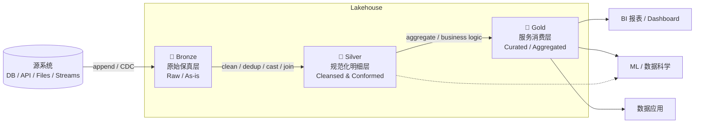

# Medallion Architecture（奖章架构）深度学习笔记

> **学习笔记系列（共 5 篇）**
> 1. Inmon —— 企业数据仓库（Corporate Information Factory）
> 2. Kimball —— 维度建模与总线架构（Dimensional Modeling）
> 3. **Medallion —— 奖章架构 / Bronze-Silver-Gold 分层（本篇）**
> 4. dbt —— 数据转换与工程化
> 5. Dagster —— 数据编排与资产化
>
> 本篇面向已有一定数据工程基础、希望系统理解 Medallion 架构的工程师。目标是既讲清「官方定义」，也讲清「工程实现细节」，同时不回避业界对该模式的争议与批评。

---

## 0. TL;DR（快速结论）

- Medallion（奖章）架构是 **Databricks 提出的一种 Lakehouse 数据组织范式**，用 Bronze / Silver / Gold 三层来表示**数据质量与成熟度的渐进提升（multi-hop）**。[¹][²]
- 它的核心思想是「**每经过一跳（hop），数据的结构与质量就提升一层**」，而不是按业务主题域切分。[¹]
- 它**不是一种建模方法论**（不与 Kimball/Inmon 对立），而是一种**分层组织范式**；Gold 层内部完全可以继续用星型模型（Kimball）或 Data Mart（Inmon）。[³][⁴]
- 技术底座通常是 **Delta Lake / Parquet**，依赖 ACID 事务、Schema Enforcement、Time Travel 等能力来保证每一层的可靠性。[⁵][⁶]
- 它遵循 **ELT（先加载后转换）** 范式，而非传统数仓的 ETL。[¹]
- 业界对它有明确的批评：**过于笼统、"银层做太多"、集中式导致刚性与延迟、"事后补救"而非"事前预防"** 等。[⁷][⁸][⁹]

---

## 1. 起源：从 Data Lake 的困境到 Lakehouse

要理解 Medallion，必须先理解它所依附的 **Lakehouse（湖仓一体）** 背景。

### 1.1 两个世界的割裂

在 2020 年前后，企业数据栈普遍是「双系统」结构：

```
                传统割裂架构
   ┌──────────────┐          ┌──────────────┐
   │  Data Lake   │          │ Data Warehouse│
   │  (S3/HDFS)   │  ──ETL──▶│  (Redshift/  │
   │  廉价、灵活   │          │   Snowflake) │
   │  但不可靠     │          │  可靠但昂贵/封闭│
   └──────────────┘          └──────────────┘
        ▲                            ▲
   ML / 原始数据                  BI / 报表
```

- **Data Lake（数据湖）**：以对象存储（S3、ADLS、HDFS）存原始文件，便宜、灵活、能存半/非结构化数据，但缺乏事务、Schema 约束，容易退化成「**Data Swamp（数据沼泽）**」。
- **Data Warehouse（数据仓库）**：可靠、有 ACID、性能好，但封闭、昂贵、对 ML 与非结构化数据支持差，还存在数据陈旧（staleness）与厂商锁定（lock-in）问题。

### 1.2 Lakehouse 论文（2021, CIDR）

2021 年，Databricks 的 Michael Armbrust、Ali Ghodsi、Reynold Xin、Matei Zaharia 在 CIDR 会议发表论文 **《Lakehouse: A New Generation of Open Platforms that Unify Data Warehousing and Advanced Analytics》**，正式提出 Lakehouse 范式。[¹⁰]

论文的核心主张是：传统数仓架构将在未来几年逐渐消亡，取而代之的是 Lakehouse ——它 **(i) 基于开放的直接访问格式（如 Parquet），(ii) 提供一流的机器学习与数据科学支持，(iii) 具备顶级的性能**。其解决的核心痛点包括：数据陈旧、可靠性、总拥有成本、数据锁定、以及有限的用例支持。[¹⁰]

技术上，Lakehouse 的可靠性来自 **Delta Lake**（对应 VLDB 论文《Delta Lake: High-Performance ACID Table Storage over Cloud Object Stores》），它在廉价对象存储之上叠加了一个**事务日志层**，从而带来 ACID、Schema 约束与 Time Travel。[⁵][⁶]

### 1.3 Medallion 应运而生

当你在一个 Lakehouse 里既有原始数据、又有清洗后的明细、还有服务 BI 的聚合结果时，**如何组织这些数据资产？** Medallion 就是 Databricks 给出的答案——一个**按数据质量分层**的组织约定。它是「**推荐的最佳实践，而非强制要求**」。[²]

> 注意：Medallion 的三层命名（青铜/白银/黄金，取自奖牌等级越高价值越高的隐喻）由 Databricks 推广，但官方术语表页面并未把该概念归属于某个具体个人。[¹]

---

## 2. 三层详解：Bronze / Silver / Gold

Databricks 官方对三层的一句话定义是：**「一种逻辑组织数据的设计模式，目标是在数据流经每一层时，增量、渐进地改善数据的结构和质量」**，因此又称 **multi-hop（多跳）架构**。[¹][²]



### 2.1 🥉 Bronze —— 原始保真层（Raw）

| 维度 | 说明 |
|---|---|
| **职责** | 作为所有源系统数据的**着陆区（landing zone）**，是企业数据的**单一事实来源（single source of truth）** |
| **数据形态** | 表结构**镜像源系统、原封不动（as-is）**，额外附加摄取元数据列 |
| **典型操作** | 增量追加（append-only）、变更数据捕获（CDC）、历史归档 |
| **数据质量** | 最低。几乎不做校验；官方建议将大多数字段以 string / VARIANT / binary 存储，以抵御源端 Schema 变化 |
| **主要用户** | 数据工程师、数据运维、合规/审计团队；**不面向分析师和数据科学家直接访问** |

**保真原则（Fidelity Principle）** 是 Bronze 层的灵魂：它「**保持数据源的原始状态和原始格式**」，从而支持在不重新读取源系统的前提下进行**重处理（reprocessing）、审计（auditability）、数据血缘（data lineage）**。[¹][²]

**关键实践 —— 摄取元数据**：为了实现血缘与可重放，Bronze 层应在原始字段之外补充摄取元数据，典型如：

```text
_ingest_time        -- 摄取/加载时间戳
_source_file        -- 来源文件路径 / topic / offset
_source_system      -- 来源系统标识
_batch_id / _process_id  -- 批次或处理进程 ID
_source_hash        -- 原始记录哈希（用于去重 / 变更检测）
```

> 官方明确提到 Bronze 表结构会「加上 load date/time、process ID 等元数据列」。[¹] 这使得 Bronze 兼具「**快速 CDC + 历史归档 + 可从原始数据随时重建下游表**」的能力。[¹]

### 2.2 🥈 Silver —— 规范化明细层（Cleansed & Conformed）

| 维度 | 说明 |
|---|---|
| **职责** | 提供**经过校验、清洗、规范化**的企业级明细数据，形成「关键业务实体的企业视图（Enterprise view）」 |
| **数据形态** | 明细粒度（非聚合），至少保留**每条记录的一个已校验、非聚合表示** |
| **典型操作** | Schema 强制（schema enforcement）、去重（dedup）、空值处理、类型转换（type casting）、多源匹配/合并/一致化（match / merge / conform）、Join、Schema 演进 |
| **数据质量** | 中高。是**数据建模真正开始的地方** |
| **主要用户** | 数据工程师、数据分析师、数据科学家（可用于 ad-hoc 报表、高级分析与 ML） |

Silver 层的关键词是 **conform（一致化）**：把来自不同源系统、格式各异的 Bronze 数据「**matched, merged, conformed and cleansed**」，得到跨源可 Join 的、语义统一的明细。[¹] 官方指出 Silver「**应始终至少包含每条记录的一个已校验的、非聚合的表示**」——这是保证下游可追溯、可重算的底线。[²]

在建模选择上，官方明确 Silver 层「更接近 **3NF（第三范式）** 的数据模型」，也可以采用「**Data Vault 风格、写性能友好的模型**」。[¹] 这也解释了业界一种主流实践：**Silver 用 Data Vault 做集成与历史化，Gold 用维度模型做展现**。[³]

### 2.3 🥇 Gold —— 服务消费层（Curated）

| 维度 | 说明 |
|---|---|
| **职责** | 提供**高度精炼、面向业务、开箱即用**的数据视图，直接驱动下游分析、Dashboard、ML 与应用 |
| **数据形态** | 通常是**聚合、过滤、去规范化（de-normalized）、读优化（read-optimized）**的宽表/汇总表，join 更少 |
| **典型操作** | 应用最终的业务逻辑与数据质量规则、聚合、面向消费场景的性能优化 |
| **数据质量** | 最高。「**最终一层的数据转换与数据质量规则在此应用**」 |
| **主要用户** | 业务/BI 分析师、数据科学家/ML 工程师、高管、运营团队 |

Gold 层常按**项目/业务域**组织成独立的库（consumption-ready、project-specific）。[¹] 官方特别指出：由于 Gold 层「**建模了一个业务域**」，一些客户会**创建多个 Gold 层**以满足 HR、财务、IT 等不同业务需求。[²] 在建模风格上，Gold 层「**倾向于 Kimball 风格的星型模型，或 Inmon 风格的 Data Mart**」。[¹]

---

## 3. 技术实现要点：Delta Lake 是怎么托住每一层的

Medallion 的每一层要「可靠」，靠的不是命名约定本身，而是底层表格式的能力。以 **Delta Lake**（当前最主流的实现，也可用 Apache Iceberg / Hudi）为例：[⁵][⁶]

### 3.1 事务日志（Transaction Log）—— 一切的核心

Delta Lake 在廉价对象存储（S3/ADLS/GCS）之上，把数据存为**不可变的 Parquet 文件**，再叠加一个**只追加（append-only）的事务日志 `_delta_log/`**。每次读取时，通过重放日志重建出一致的表快照。[⁵]

```text
my_table/
├── _delta_log/
│   ├── 00000000000000000000.json   ← commit 0（原子提交）
│   ├── 00000000000000000001.json   ← commit 1
│   └── 00000000000000000010.checkpoint.parquet  ← 每 N 次提交做检查点
├── part-0001.snappy.parquet         ← 不可变数据文件
└── part-0002.snappy.parquet
```

### 3.2 四项关键能力与 Medallion 的对应关系

| 能力 | 机制 | 在 Medallion 中的价值 |
|---|---|---|
| **ACID 事务** | 事务日志保证提交要么全成功要么全失败；并发读写不互相污染 | 每一「跳」的写入是原子的，避免读到半成品；官方称架构「**保证 ACID**」[²] |
| **Schema Enforcement（模式强制）** | 写入时校验 Schema，不匹配则拒绝 | Silver 层的清洗与一致化的技术保障，防止脏结构渗入下游 |
| **Schema Evolution（模式演进）** | 显式允许受控地新增/变更列 | 应对源端 Schema 漂移（尤其 Bronze→Silver） |
| **Time Travel（时间旅行）** | 通过 `VERSION AS OF` / `TIMESTAMP AS OF` 重放日志到历史版本 | 审计、调试、ML 可复现；支持「**可从原始数据随时重建表**」[¹] |

```sql
-- Time Travel 示例：查询某历史版本
SELECT * FROM bronze_orders VERSION AS OF 12;
SELECT * FROM bronze_orders TIMESTAMP AS OF '2026-07-01T00:00:00';
```

> 论文《Delta Lake: High-Performance ACID Table Storage over Cloud Object Stores》指出，这种基于日志（并周期性压缩为 Parquet 检查点）的设计，为大规模表格数据同时提供了 ACID、Time Travel 以及显著更快的元数据操作。[⁶]

---

## 4. 为什么按「数据质量/成熟度」分层，而不是按主题域？

这是理解 Medallion 与传统数仓分层差异的**关键**。

- 传统数仓（尤其国内实践）常把分层与「主题域/加工阶段」耦合在一起。
- Medallion 的分层轴是**唯一且正交的：数据质量与成熟度**。官方定义 Medallion「**描述了一系列表示 Lakehouse 中数据质量的数据层**」。[²]

**这样设计的好处：**

1. **正交性**：质量维度（B/S/G）与业务域维度相互独立。业务域的划分留给 Gold 层内部（多个 Gold 库），不污染分层语义。[²]
2. **可重建性（Reproducibility）**：因为 Bronze 完整保真，任何下游层都能从原始数据**重算重建**——这是「事后可回滚、可审计」的根基。[¹]
3. **心智简单**：三层三跳，团队协作时对「一份数据处于什么成熟度」有统一认知。这也是它被批评「**过于笼统**」的另一面（见第 8 节）。
4. **增量 ELT 友好**：每一跳都是一次增量转换，天然契合流批一体的增量处理。[¹]

---

## 5. ELT 范式与 Lakehouse 的关系

Medallion 与 **ELT（Extract-Load-Transform）** 深度绑定，而非传统数仓的 **ETL**。

```text
传统 ETL：  Extract → Transform（在独立引擎中转换）→ Load（入仓）
现代 ELT：  Extract → Load（先原样入 Bronze）→ Transform（在 Lakehouse 内逐层转换）
```

官方对此的描述是：Lakehouse 通常采用 **ELT 而非 ETL**——在加载到 Silver 时**只做最小的、"刚好够用（just-enough）"的转换与清洗**，以优先保证**速度与敏捷**；复杂的转换和业务规则则推迟到 **Silver→Gold** 阶段执行。[¹]

**为什么 ELT 更适配 Lakehouse：**
- 存储便宜（对象存储），先落地全量原始数据的代价很低；
- 计算与存储分离，转换按需弹性伸缩；
- Bronze 保真 + Time Travel，使「先加载后转换、错了再重算」成为可行且安全的模式。

> 实践中，Bronze→Silver→Gold 的转换层通常由 **dbt**（SQL 优先、软件工程化）或 **Lakeflow / Spark** 实现，编排由 **Dagster / Airflow** 承担——这正是本系列后两篇的主题。

---

## 6. Bronze 层的保真原则（深入）

Bronze 是整个架构「可回溯」的地基，值得单独强调其工程约束：

1. **原样保留（As-is / Immutability）**：字段不做业务清洗、不改语义。官方建议**尽量用宽松类型（string / VARIANT / binary）存储**，以抵御源端 Schema 变化——先把数据"接住"，把解析和约束推迟到 Silver。[²]
2. **只追加（Append-only）**：Bronze 增量追加，保留完整历史；配合 CDC 可重放变更流。[¹][²]
3. **摄取元数据（Ingestion Metadata）**：附加 `_ingest_time`、`_source_file/offset`、`_source_system`、`_batch_id`、`_source_hash` 等列，用于：
   - **血缘与审计**：每条记录能追溯到来源与摄取时刻；
   - **幂等与去重**：`_source_hash` 支持变更检测和重复摄取的识别；
   - **可重放**：出问题时按 `_batch_id` 精确重跑某一批。
4. **不面向终端消费**：Bronze 服务于工程/审计，分析师和数据科学家应从 Silver/Gold 取数。[²]

> 一句话：**Bronze 的价值不在"好用"，而在"忠实"**。任何丢失原始信息的清洗都应发生在 Bronze 之后。

---

## 7. 与传统数仓分层（ODS/DWD/DWS/ADS）及 Kimball/Inmon 的关系

### 7.1 与国内典型数仓分层的映射

国内数仓（尤其阿里体系）常用 ODS/DWD/DWS/ADS 分层。二者理念相通（都是"逐层提纯"），但**切分粒度和轴线不完全一一对应**，下表是**近似**映射：

| Medallion | 典型职责 | 传统数仓分层（近似） | 说明 |
|---|---|---|---|
| **Bronze** | 原始保真、单一事实来源 | **ODS**（Operational Data Store）| 都强调贴源；但 Bronze 更强调 as-is + 保真元数据，ODS 有时已做轻度规整 |
| **Silver** | 清洗、一致化、明细 | **DWD**（明细）+ 部分 **DIM**（维度）| Silver ≈ 规范化明细层；这里数据建模开始 |
| **Gold** | 聚合、业务口径、服务消费 | **DWS**（汇总）+ **ADS**（应用/集市）| Gold 对应面向消费的聚合与集市 |

> 注意：这是**教学性近似**，不是标准对齐。Medallion 只有一根轴（质量/成熟度），而 ODS/DWD/DWS/ADS 混合了「加工阶段 + 粒度 + 消费场景」多根轴，因此并非严格 1:1。业界普遍观点是「**命名不同，核心一致：数据在层层提纯**」。[⁴][¹¹]

### 7.2 Medallion 不是建模方法，而是组织范式

这是**最容易被误解**的一点。

- **Kimball（维度建模）/ Inmon（3NF EDW）** 回答的是「**数据内部结构怎么建模**」（事实表/维度表、星型/雪花、范式化程度）。
- **Medallion** 回答的是「**不同成熟度的数据资产怎么分层组织**」。

二者**不在同一个抽象层，完全可以共存**：[³][⁴]

```text
        Medallion（组织范式，纵向分层）
   Bronze ──▶ Silver ──────────▶ Gold
                │                  │
                │  可用 Data Vault  │  可用 Kimball 星型模型
                │  / 3NF 建模        │  / Inmon Data Mart
                ▼                  ▼
            建模方法论（Kimball / Inmon / Data Vault，横向选择）
```

官方文档本身就印证了这种共存：Silver 用「3NF / Data Vault 风格」，Gold 用「Kimball 星型模型 / Inmon Data Mart」。[¹] 一种被反复推荐的组合是 **Silver 层 Data Vault + Gold 层维度模型**。[³]

> 结论：**不要问"该用 Medallion 还是 Kimball"**——这是范畴错误。正确的问题是「在 Medallion 的哪一层，用哪种建模方法」。

---

## 8. 批评与局限：业界的争议

Medallion 广受欢迎，但绝非银弹。以下是有代表性的批评，工程师应了解以避免"照搬三层"。

### 8.1 "过于笼统 / 三个盒子太简单"

批评者指出，"三个盒子、三个箭头"的图示看似清晰，但**真正的设计决策（哪些逻辑放 Silver、哪些放 Gold、Silver 是否可以聚合等）图上并不体现**，落地时才是难点。[¹²] 有人甚至认为在 Microsoft Fabric 等平台上，很多团队**出于习惯而非数据集复杂度**就套用三层，导致"**过度建设（overbuilt）**"。[⁸]

### 8.2 "银层做太多 / 金层泛滥"（两个最常见的翻车点）

一篇实践审计文章总结了最常见的两个失败模式：[¹³]
- **把 Silver 当成没有规则的暂存区（staging）**——清洗、类型、一致化本该在 Silver 完成，却被跳过或稀释；
- **物化过多 Gold 表**，直到"没人知道哪张才是对的"。

对应的纪律是：「**Silver 负责清洗、一致化、类型；Gold 负责需要业务域知识的逻辑**」——边界要清晰，避免 Silver 无限膨胀或 Gold 无序繁殖。[¹⁴]

### 8.3 "集中式导致刚性、复杂、延迟"（反集中式 Medallion）

Bernd Wessely 的《The Case Against Centralized Medallion Architecture》提出了系统性批评：[⁷]
- **刚性分层**：强迫所有数据源都走同样三层是浪费——可靠的内部源、小项目、探索性分析**未必需要"黄金级"清洗**，有些数据"无需任何转换就直接可用"；
- **运维复杂度**：每一层都新增管道与校验，规模化后"**监控与调试越来越难**"；
- **延迟增加**：数据顺序逐层流动会累加延迟，**欺诈检测等时效场景**可能需要绕过 Bronze/Silver，这与分层设计冲突；
- **反应式而非预防式**：Medallion「**只在数据已经带缺陷生成之后才去改善质量**」，好比"汽车整车装完后再去修"。作者主张借鉴制造业 TQM 的 **TQDM（Total Quality Data Management）**——把质量"**设计进源头**"，从根因上治理，长期比持续下游修补更省。
- **替代/改良方向**：结合 Data Mesh 的"**通用数据供给**"——集中治理 + 去中心化实现 + **仅在真正有益处的地方选择性分层**，避免对本就干净的数据过度工程化。

### 8.4 与 Data Mesh 的张力

多篇文章（如《Data Products: A Case Against Medallion Architecture》）从 **Data Mesh / 数据产品**视角批评 Medallion 是**以技术分层为中心、而非以业务域/数据产品为中心**的组织方式。[⁹] 值得注意的是，Databricks 官方也声称 Medallion「**与 Data Mesh 概念兼容**」，Gold 表可按域拆分——即二者并非绝对互斥。[¹][²]

> **平衡的看法**：批评大多针对"**教条式、一刀切、集中式**"的 Medallion 落地，而非分层思想本身。分层提纯的核心价值（可重建、可审计、心智简单）依然成立；关键在于**按需分层、边界清晰、必要时结合域驱动/Data Mesh**。

---

## 9. 适用场景与选型建议

**Medallion 适合：**
- 构建在 Lakehouse（Delta/Iceberg/Hudi）之上的现代数据平台；
- 需要同时服务 **BI + ML + 数据应用**、且既有结构化又有半/非结构化数据；
- 强调**可审计、可重放、可复现**（金融、合规、机器学习特征回溯）的场景；
- 团队希望有**统一、低门槛的心智模型**来协作组织数据资产。

**需谨慎/裁剪的情况：**
- 数据源本就高质量、用例简单——不必强上三层（避免过度建设）；[⁸]
- 强时效场景（如实时风控）——可能需要旁路/流式直达，而非逐层跳转；[⁷]
- 强域自治、数据产品化诉求强——考虑与 **Data Mesh** 结合，而非纯集中式;[⁷][⁹]
- 质量问题应在**源头**治理时——引入上游根因治理（TQDM 思路），而非全靠下游层层修补。[⁷]

---

## 10. 小结

Medallion（Bronze/Silver/Gold）是 Databricks 在 Lakehouse 背景下提出的**按数据质量分层的组织范式**：Bronze 保真、Silver 规范、Gold 服务；底层由 Delta Lake 的 ACID / Schema Enforcement / Time Travel 托底；遵循 ELT 而非 ETL。它**不是建模方法论**，可与 Kimball / Inmon / Data Vault 在层内共存。它的最大优点是心智简单、可重建、可审计；最大风险是被教条化为"一刀切、集中式、事后补救"。**理解它的正交分层轴，同时清醒对待其局限，才能把它用好。**

下一篇（dbt）将展示如何用软件工程化的方式，把 Bronze→Silver→Gold 的转换真正落地为可测试、可版本化、可血缘追踪的模型。

---

## 参考文献

1. Databricks Glossary, *What is Medallion Architecture?* — https://www.databricks.com/glossary/medallion-architecture/
2. Databricks Documentation, *What is the medallion lakehouse architecture?* — https://docs.databricks.com/gcp/lakehouse/medallion
3. *Data Vault in Silver, Dimensional Modeling in Gold* — https://substack.com/home/post/p-176383962
4. *How I Structure My Data Pipelines* — https://loglevelinfo.substack.com/p/how-i-structure-my-data-pipelines
5. Databricks Blog, *What is Delta Lake? Boost Data Reliability in Cloud Storage* — https://www.databricks.com/blog/delta-lake-explained-boost-data-reliability-cloud-storage
6. *Insights from paper: Delta Lake: High-Performance ACID Table Storage over Cloud Object Stores* — https://hemantkgupta.medium.com/insights-from-paper-delta-lake-highperformance-acid-table-storage-over-cloud-object-stores-0adb54c35c54
7. Bernd Wessely, *The Case Against Centralized Medallion Architecture* (Towards Data Science) — https://towardsdatascience.com/the-case-against-centralized-medallion-architecture-297a1e21bc0f/
8. *Most Medallion Architectures in Microsoft Fabric Are Overbuilt / Is Medallion Overkill?* — https://www.hubsite365.com/en-ww/crm-pages/most-medallion-architectures-in-microsoft-fabric-are-overbuilt.htm
9. *Data Products: A Case Against Medallion Architecture* — https://medium.com/@community_md101/data-products-a-case-against-medallion-architecture-139096ceea08
10. Armbrust, Ghodsi, Xin, Zaharia (2021), *Lakehouse: A New Generation of Open Platforms that Unify Data Warehousing and Advanced Analytics* (CIDR) — https://www.cs.berkeley.edu/~matei/papers/2021/cidr_lakehouse.pdf
11. *Evolving Data Architectures: From Kimball to Medallion to AI-Ready Platforms* — https://community.aws/content/2y1c5LXMspCBtV9mLFpOGvdLR7k/evolving-data-architectures-from-kimball-to-medallion-to-genai-ready-platforms
12. Databricks Community, *Medallion Architecture in Practice: The Design Decisions Nobody Talks About* — https://community.databricks.com/t5/community-articles/medallion-architecture-in-practice-the-design-decisions-nobody/td-p/163206
13. *Medallion Architecture in Databricks (audit / failure modes)* — https://www.lucentinnovation.com/resources/it-insights/medallion-architecture-databricks
14. *Databricks Medallion Architecture Best Practices* — https://cosmosthrace.com/resources/databricks/databricks-medallion-architecture-best-practices
