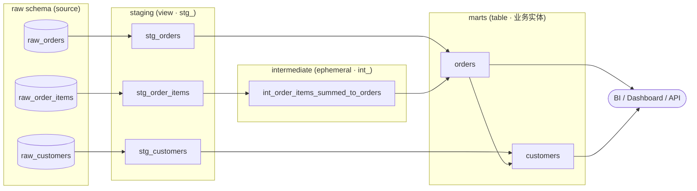
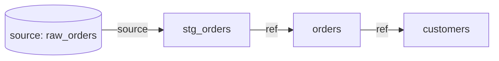

# dbt 的建模分层与最佳实践：staging / intermediate / marts

> **关于本系列**
> 这是「数据建模学习笔记」系列的第 4 篇，全系列共 5 篇，按从范式建模到现代数据栈编排的脉络组织：
>
> 1. **Inmon** —— 企业级数据仓库（CIF）与第三范式（3NF）建模
> 2. **Kimball** —— 维度建模、星型模型、事实表与维度表
> 3. **Medallion** —— Lakehouse 的 Bronze / Silver / Gold 分层
> 4. **dbt**（本篇）—— staging / intermediate / marts 的转换分层与工程化最佳实践
> 5. **Dagster** —— 资产化（asset）编排与数据平台调度
>
> 本篇面向已有一定数据工程基础、希望系统理解 dbt 建模方法论的工程师。术语保留英文原文，正文关键论断附引用编号，文末「参考文献」给出可访问的真实 URL。

---

## 1. dbt 是什么：Analytics Engineering 与「只做 T」

### 1.1 从 ETL 到 ELT，dbt 的定位

传统数仓走的是 **ETL**（Extract → Transform → Load）：数据在进入数仓之前，先在独立的处理引擎（如 Informatica、Spark 脚本）里被清洗、聚合，再加载进目标表。

现代云数仓（Snowflake / BigQuery / Redshift / DuckDB 等）算力弹性、存储廉价，范式转向了 **ELT**（Extract → Load → **Transform**）：先把原始数据「原样」灌进数仓的 `raw` schema，**转换发生在数仓内部**，用 SQL 表达。

**dbt（data build tool）只负责这条链路里的最后一个字母「T」。** 它不搬运数据（不做 E 和 L），而是假设原始数据已经躺在数仓里，然后用「SELECT 语句 + Jinja 模板 + YAML 配置」把 source-conformed 的原始表，一层层重塑成 business-conformed 的业务模型 [1]。dbt 官方结构指南把这一过程称为整个转换层存在的根本目的：

> "One foundational principle that applies to all dbt projects... is the need to establish a cohesive arc moving data from *source-conformed* to *business-conformed*." [1]

- **Source-conformed**（源系统塑形）：数据形状由我们无法控制的外部系统决定（订单系统的字段名、类型、粒度）。
- **Business-conformed**（业务塑形）：数据形状由我们自己的业务概念、定义和需求决定。

整个 dbt 项目就是把「**很多张窄的、源塑形的表**」收敛成「**少量宽的、业务塑形的实体**」的一段弧线 [1]。

### 1.2 Analytics Engineering 的理念

dbt 催生了「**Analytics Engineer**（分析工程师）」这一角色——介于数据工程师和数据分析师之间。核心理念是把**软件工程的最佳实践引入数据转换**：

- **模块化（modularity）**：不再写动辄上千行的巨型 SQL 存储过程，而是拆成可复用、可测试、可版本控制的小模型 [2]。
- **DRY（Don't Repeat Yourself）**：一个转换逻辑只在一个地方定义，下游通过引用复用它 [1][3]。
- **版本控制、代码评审、CI/CD、测试、文档**：像管理应用代码一样管理数据管道。

dbt 官方结构指南把「保持一致的约定」上升到降低团队决策疲劳的高度，用了一个著名的比喻：

> "Famously, Steve Jobs wore the same outfit everyday to reduce decision fatigue. You can think of this guide similarly, as a black turtleneck and New Balance sneakers for your company's dbt project." [1]

换句话说：**分层与命名约定的价值，首先在于让团队把脑力花在真正的业务问题上，而不是纠结「文件放哪、怎么命名」。**

---

## 2. dbt 官方推荐的三层结构总览

dbt Labs 在《How we structure our dbt projects》指南中给出的标准骨架，是围绕上述「源塑形 → 业务塑形」的弧线组织的三层，全部放在 `models/` 目录下 [1]：

| 层 | 目录 | 前缀 | 职责一句话 | 典型物化 |
|---|---|---|---|---|
| **Staging** | `models/staging/` | `stg_` | 从 source 造出干净的「原子」——一源一模型 [4] | `view` |
| **Intermediate** | `models/intermediate/` | `int_` | 用有明确目的的逻辑层，把原子拼装成「分子」[5] | `ephemeral` / 受限 `view` |
| **Marts** | `models/marts/` | 业务实体名 / `fct_`、`dim_` | 交付面向业务实体的宽表，供下游消费 [6] | `table` / `incremental` |

数据流向可以画成一个「箭头」：



dbt 官方对这个 DAG 形状有一句提纲挈领的口诀：

> **"Narrow the DAG, widen the tables."** —— 在到达 marts 之前，DAG 应该像一个指向右方的箭头：从**大量窄的、源塑形的概念**，收敛成**少量宽的、业务塑形的联合概念** [5]。

配套的经验法则：**允许一个模型有多个输入（多个箭头进），但不应有多个输出（多个箭头出）。** 多个箭头指进来是正常的（join），多个箭头指出去则是危险信号——意味着同一逻辑被下游各自重复实现，破坏了单一事实来源 [5]。

三层各自建立在前一层之上，官方总结为 [1]：

1. **Staging** —— "creating our atoms, our initial modular building blocks, from source data"
2. **Intermediate** —— "stacking layers of logic with clear and specific purposes to prepare our staging models to join into the entities we want"
3. **Marts** —— "bringing together our modular pieces into a wide, rich vision of the entities our organization cares about"

---

## 3. Staging 层：制造原子构件

Staging 是整个项目的地基——把杂乱的原始数据浓缩、精炼成下游一切模型都要用到的「原子构件」[4]。

### 3.1 核心规则

**一源一模型（1-to-1 with source tables）。** 每张 source 表对应且只对应一个 staging 模型，它是该源表进入项目的唯一入口。**`source()` 宏只在 staging 层出现**，其他任何层都不允许直接引用 source [4]。

**只做原子级的准备工作**，允许的转换只有这几类 [4]：

- ✅ 改名（renaming）——把源字段名规整成项目统一的命名习惯
- ✅ 类型转换（type casting）
- ✅ 基础计算（如「分转元」`cents_to_dollars`）
- ✅ 分类/打标（把条件逻辑收成布尔或分桶）

**明确禁止的两件事** [4]：

- ❌ **Join** —— join 会造成重复计算，并让下游关系变得混乱。staging 的目标是清洗单个源塑形概念，而不是拼装它们。（极少数确实需要 join 才能 stage 的场景，用 `base` 子模型处理。）
- ❌ **Aggregation** —— 聚合会改变数据粒度（grain），丢失后续大概率还要用到的源级明细。聚合留到下游做。

### 3.2 命名与目录

- 模型名：`stg_[source]__[entity]s.sql`，例如 `stg_stripe__payments.sql`。**source 与 entity 之间用双下划线 `__` 分隔**，视觉上把「源系统」和「实体」清晰切开（`google_analytics__campaigns` 无歧义，而 `google_analytics_campaigns` 会含糊）[4]。
- **实体名用复数**——SQL 应读起来像散文，一张表装的是多行记录 [4]。
- 目录**按源系统（source system）建子目录**（交易库、Stripe API、Snowplow 事件各一个），因为同源表往往共享加载方式和表属性。**不要**按加载工具（Fivetran/Stitch）或业务部门（marketing/finance）分——后者会过早把「原子」割裂，埋下同名不同义的定义冲突 [4]。

```
models/staging
├── __sources.yml          # source() 声明集中在这里
├── stg_ecom__customers.sql
├── stg_ecom__orders.sql
└── stg_ecom__order_items.sql
```

### 3.3 标准模型样板：两段式 CTE

每个 staging 模型都遵循同一个「铁打的」模式：**一段 CTE 取源，一段 CTE 做转换** [4]：

```sql
-- stg_ecom__orders.sql
with

source as (
    select * from {{ source('ecom', 'raw_orders') }}
),

renamed as (
    select
        ---------- ids
        id            as order_id,
        store_id      as location_id,
        customer      as customer_id,

        ---------- numerics（分转元，DRY 的基础计算下沉到这里）
        {{ cents_to_dollars('subtotal') }}    as subtotal,
        {{ cents_to_dollars('tax_paid') }}    as tax_paid,
        {{ cents_to_dollars('order_total') }} as order_total,

        ---------- timestamps
        {{ dbt.date_trunc('day', 'ordered_at') }} as ordered_at

    from source
)

select * from renamed
```

### 3.4 物化：整层用 view

staging 层**整体物化为 `view`**，在 `dbt_project.yml` 里对整个目录统一配置 [4][7]：

```yaml
# dbt_project.yml
models:
  jaffle_shop:
    staging:
      +materialized: view
```

view 的好处：下游模型永远拿到最新数据，且不占用仓库存储（staging 通常不被消费者直接查询）。dbt Labs 至今仍强烈建议 staging 层「以 view 为主、而非 table」[7]。

### 3.5 DRY 是取舍的试金石

判断一个转换「该不该放进 staging」，标准就是 DRY：**把所有「无论如何都需要」的转换尽量往上游推**，让下游引用而非重做。如果某个转换在每个下游模型里都要用、并且能消除重复代码，它就属于 staging [4]。

> 实战顺序小贴士：虽然指南按 DAG 顺序讲解（先 staging 后 marts），真实开发常常**反过来**——先在电子表格里 mock 出目标 mart 的样子，写出 mart 的 SQL，识别涉及哪些表，再把这些表 stage 成原子，最后把复用逻辑重构回 intermediate 层 [4]。

---

## 4. Intermediate 层：有目的的转换步骤

Intermediate 夹在 staging 和 marts 之间，把 staging 造出的「原子」组合成有特定用途的「分子」，是通往最终 marts 的中间形态 [5]。

### 4.1 三类典型用途

intermediate 模型服务于单一清晰的目的——为 marts 做准备。最常见的三种场景 [5]：

1. **结构简化（Structural simplification）**：把数量适中（通常 4–6 个）的实体/概念先聚到一起，再与另一个 intermediate 模型 join 成 mart。与其在一个 mart 里写 10 个 join，不如让两个各承担一部分复杂度的 intermediate 模型 join。可读性、灵活性、可测试面积、组件洞察力都更好。
2. **重整粒度（Re-graining）**：把模型 fan out（打散）或 collapse（收拢）到正确的复合粒度。例如按 `quantity` 把 `orders` 打散成「一行一件商品」，为 `order_items` 这个 mart 做准备。
3. **隔离复杂运算（Isolating complex operations）**：把特别复杂、难懂的逻辑单独抽成一个模型，方便打磨、排错和测试，让下游用可读的方式引用这个概念。

### 4.2 命名：用动词思考

命名模式 `int_[entity]s_[verb]s.sql`。**核心指导原则是「想动词」**——`pivoted`、`aggregated_to_user`、`joined`、`fanned_out_by_quantity`、`funnel_created` 等。把订单明细聚合到订单粒度，就叫 `int_order_items_summed_to_orders`。名字长没关系，只要能让转换自解释 [5]。

与 staging 的关键区别：**去掉双下划线**——因为已经在朝业务塑形的统一概念靠拢，引用的是合并后的实体而非「源系统 + 实体」。只有当模型必须在源系统层面操作（如后续要 union 的 `int_shopify__orders_summed`、`int_core__orders_summed`）时才保留双下划线 [5]。

### 4.3 目录与「不对外暴露」

intermediate 模型放在 `intermediate/` 子目录，**按业务领域（business grouping）分**，而不像 staging 那样按源系统分 [5]：

```
models/intermediate
└── finance
    ├── _int_finance__models.yml
    └── int_orders_summed_to_customer.sql
```

**intermediate 模型一般不应出现在生产主 schema 里。** 它们不是给 dashboard、应用等最终目标用的，隔离开来才能控制数据治理和可发现性。dbt 官方强调：**要把仓库里的 schema / 表 / 视图当作 UX（用户体验）的一部分**——用户不该在生产 schema 里看到一堆中间产物 [5]。

### 4.4 物化：ephemeral 或受限 view

两种推荐选项 [5]：

- **`ephemeral`（最佳起点）**：不在仓库里落任何对象，dbt 把它作为 CTE 内联进引用它的模型。配置最省心。代价是**难排错**（它不独立存在，无法单独查询）。
- **写进带特殊权限的自定义 schema 的 `view`（更健壮）**：开发期能单独查看、复杂度上升后更易排错，实现简单、占用可忽略。

### 4.5 别过早优化

目标是单一事实来源。**别太早拆子目录或加层**。如果 marts 模型少于 10 个、也没遇到问题，intermediate 层完全可以先不用子目录（唯独 staging 应始终按源系统分子目录），等项目真正长大再拆 [5]。

---

## 5. Marts 层：面向业务实体的交付层

Marts 是 staging 的「原子」终于组装成「有身份、有目的的完整细胞」的地方，也叫 **entity layer / concept layer**。每个 mart 代表一个特定的业务实体或概念，处在它自己独有的粒度上——一笔订单、一个客户、一个区域、一次点击、一笔支付。**每一行都是该概念的一个离散实例。这是第一层明确面向终端用户暴露的层** [6]。

### 5.1 命名：`fct_`/`dim_` 还是朴素实体名？——一个重要的演变

这是初学者最容易踩坑、也是 dbt 社区口径发生过变化的地方，必须讲清楚：

- **经典 / 早期约定（沿用 Kimball 维度建模）**：marts 里区分事实表和维度表，用 `fct_`（fact，如 `fct_orders`）和 `dim_`（dimension，如 `dim_customers`）前缀。这套命名直接继承自本系列第 2 篇讲的 Kimball 星型模型，至今仍在大量团队和许多把 dbt 目录当作 Medallion/Kimball 载体的项目里使用。
- **dbt 官方当前指南的推荐**：**已经不再推荐 `fct_`/`dim_` 前缀，也不强调传统 Kimball 星型模型**。官方明确写道 "Unlike in a traditional Kimball star schema..."，转而建议**用朴素英文实体名**，按粒度命名，如 `customers`、`orders` [6]。

> 结论：**两种命名都能在真实项目里见到。** `fct_`/`dim_` 是 Kimball 传统在 dbt 里的延续；朴素实体名是 dbt 当前官方风格。选哪种不重要，**团队内保持一致、并显式声明约定**才重要（回到第 1.2 节「黑色高领衫」的精神）[1][6]。

其他命名戒律 [6]：
- ✅ 按粒度用朴素实体名。纯 mart 应避免带时间的名字（`orders_per_day`）——那类东西该用 metrics 层捕获。
- ❌ 不要为不同团队把同一概念建成不同模型。`finance_orders` 和 `marketing_orders` 是反模式。若需求真的分叉，就命名成不同概念：`tax_revenue` 与 `revenue`，而不是 `finance_revenue` 与 `marketing_revenue`。

### 5.2 反范式化（denormalization）：宽而富

在现代数仓里存储便宜、算力贵，所以 marts 乐于从其他概念「借」任何相关数据来回答关于核心实体的问题。**把同一份数据在多处构建（例如把 `orders` 数据拉进 `customers` mart），比反复重新 join 更高效。marts 应该是宽的、反范式化的** [6]。

> 注意与 Semantic Layer 的取舍 [6]：
> - **不用 Semantic Layer** → 大胆反范式化（上面的默认做法）。
> - **用 Semantic Layer** → 尽量保持规范化（normalized），给 MetricFlow 最大灵活度。

### 5.3 示例：`orders` mart 与建立在其上的 `customers` mart

`orders` mart 汇总订单明细、算出布尔标记，保持订单粒度 [6]：

```sql
-- orders.sql
with
orders as (
    select * from {{ ref('stg_orders') }}
),
order_items_summary as (
    select
        order_id,
        sum(product_price) as order_items_subtotal,
        count(order_item_id) as count_order_items,
        sum(case when is_food_item then 1 else 0 end) as count_food_items
    from {{ ref('order_items') }}
    group by 1
)
select
    orders.*,
    order_items_summary.order_items_subtotal,
    order_items_summary.count_order_items,
    order_items_summary.count_food_items > 0 as is_food_order
from orders
left join order_items_summary using (order_id)
```

`customers` mart **建立在 `orders` mart 之上**，把订单聚合到客户粒度——这是「一个 mart 引用另一个 mart」的合法例子 [6]：

```sql
-- customers.sql
with
customers as (
    select * from {{ ref('stg_customers') }}
),
customer_orders_summary as (
    select
        customer_id,
        count(distinct order_id)      as count_lifetime_orders,
        min(ordered_at)               as first_ordered_at,
        sum(order_total)              as lifetime_spend
    from {{ ref('orders') }}
    group by 1
)
select
    customers.*,
    customer_orders_summary.count_lifetime_orders,
    customer_orders_summary.lifetime_spend
from customers
left join customer_orders_summary using (customer_id)
```

### 5.4 物化：从 view 到 table 到 incremental

官方的「渐进式」经验法则 [6]：

> **先用 view**（不占存储、永远最新）→ 当 view 查询太慢，就建成 `table` → 当 table 构建太慢、拖累整体 run，就配成 `incremental`（增量）。**从简单开始，只在需要时加复杂度。**

其他 marts 注意事项 [6]：
- ❌ 一个 mart 里别塞太多 join。大约 **4–5 个以上概念**就是引入 intermediate 层的信号——「两个各拼 3 个概念的 intermediate 喂给一个 mart」比「一个 mart 直接 6 路 join」可读得多。
- ✅ 跨粒度的 mart 之间传数据（orders → customers）可以，但要小心避免浪费资源或循环依赖。
- 排错技巧：把一条链暂时都建成 `table`，能让仓库在错误真正发生的那个模型上抛错（错误常源自更上游的依赖）。

---

## 6. Source 概念：dbt 不负责 EL

前面反复强调「dbt 只做 T」。这在工程上落地为 **source（数据源）** 概念。

原始数据是**外部系统灌进数仓的**（由 Fivetran、Airbyte、自研 EL 作业等完成），对 dbt 而言它们是**项目边界之外的输入**。dbt 用 `sources.yml` 把这些 raw 表**声明**为 source，然后 staging 模型通过 `{{ source('ecom', 'raw_orders') }}` 引用它们 [8]：

```yaml
# models/staging/__sources.yml
version: 2
sources:
  - name: ecom
    database: raw
    schema: ecommerce
    tables:
      - name: raw_orders
        # 数据新鲜度检查：若 max(loaded_at) 超时则告警/报错
        loaded_at_field: _loaded_at
        freshness:
          warn_after:  {count: 12, period: hour}
          error_after: {count: 24, period: hour}
      - name: raw_customers
```

声明 source 带来三个价值 [8]：

1. **血缘（lineage）**：source 成为 DAG 的起点，`dbt docs` 能画出「raw 表 → staging → … → mart」的完整依赖图。
2. **新鲜度检查（source freshness）**：`dbt source freshness` 用 `loaded_at_field` 时间戳与当前时间比较，判断上游 EL 是否按时把数据送到，超过 `warn_after` / `error_after` 阈值就告警或报错——这是「转换开始前先确认数据到齐」的守门员 [8]。
3. **集中管理**：改数据库/schema 名只需改一处 YAML，所有引用自动生效。

> 关键点：**dbt 管理的是 source 之后的一切转换，不管 source 本身怎么来的。** raw 层的产生（E 和 L）不在 dbt 职责内——这正是「dbt 只做 T」在项目结构上的体现。

---

## 7. 关键工程实践

### 7.1 `ref()` / `source()` 与自动血缘

dbt 里模型之间**永远不用硬编码表名**，而用两个函数建立引用：

- `{{ source('ecom', 'raw_orders') }}` —— 引用外部原始表（仅 staging 用）。
- `{{ ref('stg_orders') }}` —— 引用另一个 dbt 模型。

这两个函数不只是「拼出表名」——**每一次 `ref()` / `source()` 调用都编码了一条依赖边**，dbt 把所有边收集成一张 **DAG（有向无环图）**。血缘因此是「正常开发的副产品」，无需额外维护 [10][12]。

### 7.2 DAG 驱动的执行顺序

运行 `dbt run` 时，dbt **不是随机发 SQL**，而是先从 `ref()` 构建依赖图，再据此拓扑排序、按正确顺序执行，还能并行跑互不依赖的分支 [12]。DAG 也是**选择接口**——`dbt build --select staging+` 表示「构建 staging 及其所有下游」，`+my_mart` 表示「构建 my_mart 及其所有上游」[4]。



### 7.3 Materialization（物化策略）小结

Materialization 把建表的 DDL/DML 抽象掉——你只写 `SELECT`，dbt 负责翻译成「建视图 / 建表 / 增量合并」等命令式指令 [13]。四种内建物化：

| 物化 | 仓库里的形态 | 何时用 | 典型层 |
|---|---|---|---|
| `view` | 视图（不存数据，每次查询重算） | 默认；查得不频繁、要永远最新、不占存储 [14] | staging |
| `table` | 物理表（每次 run 全量重建） | view 查询太慢；需要被频繁/复杂查询 [14][15] | marts |
| `incremental` | 物理表（只处理新增/变更行） | table 全量重建太慢、数据量大；用途同 table 但要性能 [15] | 大 marts / 事件表 |
| `ephemeral` | 不落对象，作为 CTE 内联进下游 [14] | 轻量中间逻辑、不想污染仓库；代价是难排错 [5][14] | intermediate |

选择顺序仍是那句：**view → table → incremental，从简单到复杂，只在遇到性能瓶颈时才升级** [6][15]。

### 7.4 测试（Tests）

dbt 的测试本质上就是 `SELECT` 语句——**查询「反例」记录**：断言一个条件，测试去捞违反该条件的行；捞到 0 行则通过 [16]。分两类：

- **Generic tests（通用测试，原称 schema tests）**：在 YAML 里声明、可复用。dbt 内建四个：`unique`、`not_null`、`accepted_values`、`relationships`（外键完整性）[17][18]。还可自定义 generic test。

```yaml
# models/marts/orders.yml
models:
  - name: orders
    columns:
      - name: order_id
        data_tests:
          - unique
          - not_null
      - name: customer_id
        data_tests:
          - relationships:
              to: ref('customers')
              field: customer_id
      - name: status
        data_tests:
          - accepted_values:
              values: ['placed', 'shipped', 'completed', 'returned']
```

> 实战提醒：`not_null` 只该用在「本就不该为空」的列上；给真正可选的列（如 `middle_name`、未结束订阅的 `end_date`）加 `not_null`，会在合法数据上不停误报 [17]。

- **Singular tests（单例测试）**：写在 `tests/` 目录里的一次性 SQL，表达某个具体的业务断言（如「订单金额不能为负」），返回失败记录即视为不通过 [16]。

### 7.5 文档与 DAG 可视化

模型、列、测试的描述写在 YAML 里，`dbt docs generate` + `dbt docs serve` 能生成一个可交互的文档站点，含**自动血缘 DAG 图**，帮助下游消费者发现和理解数据集 [19]。文档、测试、血缘三者共享同一份 YAML 元数据，是 dbt「代码即文档」的核心。

---

## 8. dbt 分层 vs Medallion：动机不同，可以混搭

初学者常把 dbt 的 staging/intermediate/marts 与 Medallion 的 Bronze/Silver/Gold **一一对号入座**，这里要点出一个关键区别——**两者的分层动机不同**。

### 8.1 动机差异

- **Medallion（Bronze/Silver/Gold）是「按数据质量/精炼程度」分层**：数据从原始（Bronze）→ 清洗校验（Silver）→ 业务就绪（Gold），**每张表恰好属于一层**，层级代表「质量/可信度递增」这条硬性纵轴 [21][29]。
- **dbt 分层是「按转换职责 / 代码模块化」分层**：staging/intermediate/marts 划分的是**代码的职责与复用关系**（造原子 / 拼分子 / 交付实体），本质是软件工程的模块化，而非「质量等级」这条轴 [1][5]。

换句话说：Medallion 回答「这份数据被清洗到什么程度了？」，dbt 分层回答「这段转换逻辑在整条流水线里扮演什么角色、被谁复用？」。这也是为什么 dbt 官方几乎从不用「数据质量层」来描述自己的三层，而是反复用「原子 → 分子 → 实体」「源塑形 → 业务塑形」的模块化语言 [1]。

### 8.2 映射与混搭

尽管动机不同，两套体系在**实践中高度重叠**，很多团队直接**用 dbt 的目录骨架来承载 Medallion 的语义** [20][23][26]：

| Medallion | 语义（质量视角） | dbt 层（职责视角） | 常见落地 |
|---|---|---|---|
| **Bronze** | 原始、未加工 | （dbt 之外的）**source** + 可选薄 staging | raw schema / `source()` 声明 |
| **Silver** | 清洗、校验、去重、标准化 | **staging (+ intermediate)** | `stg_` view + `int_` 逻辑 |
| **Gold** | 业务就绪、聚合、可消费 | **marts** | `fct_`/`dim_` 或朴素实体宽表 |

Databricks 普及了 Bronze/Silver/Gold 这套命名，但这个「三段递进」模式有很多别名——dbt 叫 staging/intermediate/marts，别的团队叫 raw/curated/refined 或 landing/transform/serving [23]。行业里一个流行的落地方式是：**用 Medallion 命名 schema（bronze/silver/gold），用 dbt 的 staging/intermediate/marts 组织 models 目录**，两套词汇各管一层含义、并行不悖 [20][23]。

> 一句话记忆：**Medallion 管「schema/表叫什么、质量到哪一级」，dbt 分层管「models 目录怎么切、代码怎么复用」。** 用 dbt 实现 Medallion 是常态，但别把两者的「层数对齐」当成硬规则——staging 常同时承担 Bronze 尾巴和 Silver 头部，intermediate 未必对得上任何一个 Medallion 层 [20][23]。

（Medallion 的完整讲解见本系列第 3 篇。）

---

## 9. dbt 分层 vs 传统数仓（ODS / DWD / DWS / ADS）

在中文数据仓库语境里（尤其阿里系规范），常见的是 ODS/DWD/DWS/ADS 分层。它更接近 Inmon（3NF 明细）与 Kimball（维度汇总）的混合。对照关系如下（近似映射，非严格等价）：

| 传统数仓层 | 全称 / 含义 | 大致对应 dbt 层 | 大致对应 Medallion |
|---|---|---|---|
| **ODS** | Operational Data Store，贴源原始明细 | source（dbt 之外）+ 薄 staging | Bronze |
| **DWD** | Data Warehouse Detail，清洗后的明细事实 | staging / intermediate | Silver |
| **DWS** | Data Warehouse Summary，轻度汇总/宽表 | intermediate / marts | Silver→Gold |
| **ADS** | Application Data Store，面向应用的结果集 | marts | Gold |

要点：
- **ODS ≈ source**：贴源、尽量不加工，dbt 里体现为 `source()` 声明的 raw 表，不属于 dbt 转换职责。
- **DWD ≈ staging + intermediate**：清洗、规整、维度退化，产出干净明细。
- **DWS ≈ intermediate + marts**：按主题轻度汇总的宽表。
- **ADS ≈ marts**（尤其偏应用/报表的那部分）：直接喂给报表、接口、算法的结果。

传统四层更强调「明细 → 汇总 → 应用」的**数据精炼纵轴**（这点更像 Medallion），而 dbt 三层强调**代码模块化横轴**——理解这个差异，就不会在「DWS 到底该映射到 intermediate 还是 marts」这种问题上钻牛角尖：**看这段逻辑的职责，而不是硬套层名。**

---

## 10. 优缺点与适用场景

### 10.1 优点

- **模块化 + DRY**：转换逻辑只定义一次，血缘自动生成，改一处全链路生效 [1][10]。
- **工程化闭环**：版本控制、测试、文档、CI/CD、环境隔离一应俱全，把「数据脚本」升级为「数据软件」[2]。
- **自文档化血缘**：`ref()`/`source()` 天然产出 DAG，`dbt docs` 一键生成文档站 [12][19]。
- **约定降噪**：统一分层与命名让团队减少决策疲劳、快速上手陌生项目 [1]。
- **仓库无关**：同一套 SQL + 物化抽象可跑在 Snowflake / BigQuery / Redshift / DuckDB 等多种引擎上 [13]。

### 10.2 局限

- **只做 T，不做 EL**：数据搬运、CDC、实时摄取需要额外工具（Fivetran/Airbyte/Kafka 等），dbt 不覆盖。
- **偏批处理**：dbt 的心智模型是「按 run 批量重算」，对**亚秒级实时/流式**场景不是天然契合 [10]。
- **SQL 中心**：复杂的非 SQL 逻辑（重型 ML、复杂过程式计算）虽有 Python models，但仍不如通用编程语言灵活。
- **编排能力有限**：dbt 本身管的是「模型间依赖」，跨系统的调度、回填、传感器等编排能力较弱——这正是本系列第 5 篇 **Dagster** 要补的位（把 dbt 模型作为 asset 纳入统一编排）。
- **过度分层风险**：过早拆 intermediate/子目录会增加复杂度，官方反复告诫「别过早优化」[5]。

### 10.3 适用场景

- ✅ 云数仓 / Lakehouse 上的 **ELT** 转换层——dbt 的主场。
- ✅ 需要**团队协作、可测试、可审计**的分析工程实践。
- ✅ 承载 **Kimball 维度建模**或 **Medallion** 语义的转换代码骨架。
- ⚠️ 实时流式、重型非 SQL 计算、纯数据搬运——需搭配其他工具，dbt 只做其中的 T。

---

## 11. 小结

dbt 把「转换层」这件事工程化了：它**只做 ELT 里的 T**，以 `source()` 为边界之外的输入起点，用 staging（造原子）→ intermediate（拼分子）→ marts（交付业务实体）三层，沿着「源塑形 → 业务塑形」的弧线，把很多张窄表收敛成少量宽而富的业务实体 [1]。`ref()`/`source()` 自动织出血缘 DAG，materialization 抽象掉建表细节，tests / docs 共享 YAML 元数据形成「代码即文档」的闭环。

理解 dbt 分层，最关键的一点是：**它是按「转换职责与代码复用」分层，而非按「数据质量等级」分层。** 这与 Medallion（质量纵轴）、传统 ODS/DWD/DWS/ADS（精炼纵轴）动机不同，但可以自然混搭——用 dbt 目录骨架承载 Medallion 或 Kimball 语义，是当今最主流的落地方式。看职责、而非硬套层名，才是用好 dbt 分层的心法。

（下一篇：**Dagster** —— 如何用资产化编排把 dbt 模型、源数据、ML 作业统一到一张可观测的调度图里。）

---

## 参考文献

**dbt 官方文档（docs.getdbt.com）**

1. How we structure our dbt projects — Guide overview. https://docs.getdbt.com/best-practices/how-we-structure/1-guide-overview
2. Modular data modeling techniques with dbt（dbt Labs Blog）. https://www.getdbt.com/blog/modular-data-modeling-techniques
3. （同 1）源塑形→业务塑形与 DRY 原则. https://docs.getdbt.com/best-practices/how-we-structure/1-guide-overview
4. Staging: Preparing our atomic building blocks. https://docs.getdbt.com/best-practices/how-we-structure/2-staging
5. Intermediate: Purpose-built transformation steps. https://docs.getdbt.com/best-practices/how-we-structure/3-intermediate
6. Marts: Business-defined entities. https://docs.getdbt.com/best-practices/how-we-structure/4-marts
7. Staging Models Best Practices and Limiting View Runs（dbt Labs Blog）. https://www.getdbt.com/blog/staging-models-best-practices-and-limiting-view-runs
8. Add sources to your DAG. https://docs.getdbt.com/docs/build/sources
9. Source freshness（deploy）. https://docs.getdbt.com/docs/deploy/source-freshness
13. Materializations best practices — Guide overview. https://docs.getdbt.com/best-practices/materializations/1-guide-overview
14. Available materializations. https://docs.getdbt.com/best-practices/materializations/2-available-materializations
15. Best practices for materializations. https://docs.getdbt.com/best-practices/materializations/5-best-practices
16. Add data tests to your DAG. https://docs.getdbt.com/docs/build/data-tests
18. Writing custom generic data tests. https://docs.getdbt.com/guides/best-practices/writing-custom-generic-tests
19. About documentation. https://docs.getdbt.com/docs/build/documentation

**权威/社区分析工程文章**

10. Data Lineage with dbt: Complete Guide（Dawiso）. https://dawiso.com/glossary/dbt-lineage
11. Staging vs Intermediate vs Mart Models in dbt（Towards Data Science）. https://towardsdatascience.com/staging-intermediate-mart-models-dbt-2a759ecc1db1/
12. How Dependency Graphs Drive Execution Order in Data Pipelines（npblue）. https://npblue.com/data/dbt/dbt-the-dbt-dag/
17. unique, not_null, accepted_values, and relationships（npblue）. https://npblue.com/data/dbt/dbt-generic-tests

**dbt 分层 vs Medallion / 数仓分层**

20. DBT Naming Conventions and Medallion Architecture（i-spark）. https://i-spark.nl/en/blog/dbt-naming-conventions-and-medallion-architecture/
21. Bronze, Silver, Gold Data Lake Pattern（Datavidhya）. https://datavidhya.com/learn/de-system-design/architecture-patterns/medallion-architecture/
23. How I Structure My Data Pipelines（loglevelinfo）. https://loglevelinfo.substack.com/p/how-i-structure-my-data-pipelines
26. Implementing a Medallion Architecture Data Pipeline on Azure with dbt（Medium）. https://medium.com/@jushijun/implementing-a-medallion-architecture-data-pipeline-on-azure-with-data-factory-databricks-and-dbt-4b348b89e02a
29. Designing a Medallion Framework — A Decision Guide（Microsoft Tech Community）. https://techcommunity.microsoft.com/blog/azurearchitectureblog/designing-a-medallion-framework-%E2%80%94-a-decision-guide/4514349
