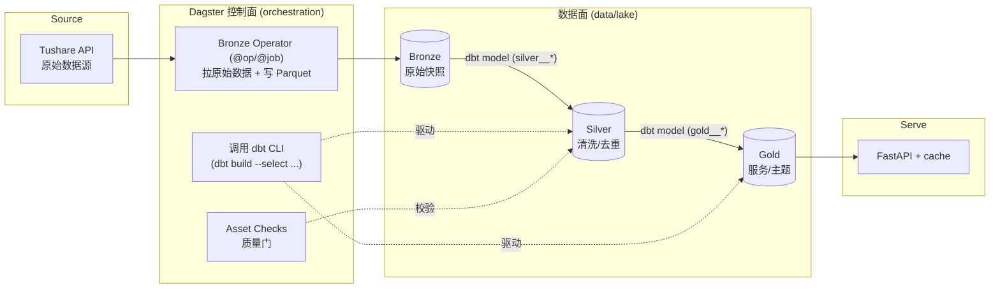

# Dagster：资产化（asset-based）编排与它在数仓分层中的角色

> **关于本系列**
> 这是「数据建模学习笔记」系列的第 5 篇，也是收官篇，全系列共 5 篇，按从范式建模到现代数据栈编排的脉络组织：
>
> 1. **Inmon** —— 企业级数据仓库（CIF）与第三范式（3NF）建模
> 2. **Kimball** —— 维度建模、星型模型、事实表与维度表
> 3. **Medallion** —— Lakehouse 的 Bronze / Silver / Gold 分层
> 4. **dbt** —— staging / intermediate / marts 的转换分层与工程化最佳实践
> 5. **Dagster**（本篇）—— 资产化（asset）编排与数据平台调度
>
> 本篇面向已有一定数据工程基础、希望系统理解 Dagster 的工程师。术语保留英文原文，正文关键论断附引用编号，文末「参考文献」给出可访问的真实 URL。
>
> **一句话定位**：前四篇讲的是「数据长成什么样」（建模方法论），本篇讲的是「谁来决定什么时候、按什么顺序把数据算出来，并且保证算出来的东西是对的」（编排与控制面）。Dagster 不是又一种建模范式，它是**把 Bronze / Silver / Gold 各层数据资产串成一张有向无环图（DAG）、并对每个资产挂上质量校验的控制层**。

---

## 1. Dagster 是什么：从 workflow engine 到 data orchestrator

### 1.1 诞生背景

Dagster 由 **Nick Schrock**（Facebook GraphQL 的联合作者）在 2018 年创立 Elementl 公司后启动，开源项目于 **2019 年**发布，`1.0` 稳定版在 2022 年发布，同年引入了标志性的 **Software-Defined Assets（软件定义资产）** 概念 [1][6][7]。它的自我定位很明确：

> "Dagster is a data orchestrator built for data engineers, with integrated lineage, observability, a declarative programming model, and best-in-class testability." [2]

翻译过来：Dagster 是**为数据工程师打造的数据编排器（data orchestrator）**，内建血缘（lineage）、可观测性（observability）、声明式（declarative）编程模型，以及一流的可测试性。

它诞生的动机，是官方所说的「数据领域的工具与工程危机」——数据的复杂度和关键性在飙升，但用来构建和运维数据管道的工具与流程严重滞后 [8]。Dagster 想把**软件工程与 DevOps 的最佳实践**（可测试、可复现、版本化、本地可运行）带进数据管道的构建。

### 1.2 「data orchestrator」而不是「workflow engine」

传统的 workflow engine（以 Airflow 为代表）只管**任务的排序与物理执行**。Dagster 官方那篇经典博文把自己描述成「一种新型的工作流引擎」：

> "Dagster is a new type of workflow engine: a data orchestrator. Moving beyond just managing the ordering and physical execution of data computations, Dagster introduces a new primitive: a data-aware, typed ... asset." [9]

关键词是 **data-aware（数据感知）**。传统编排器眼里只有「任务 A 跑完了没有」，Dagster 眼里是「`silver__bak_daily` 这张表是不是最新的、它是由哪段代码、从哪些上游算出来的、下一次什么时候会更新」。

---

## 2. task-based vs asset-based：编排哲学的根本分野

这是理解 Dagster 最重要的一节。它与 Airflow 的差别不是 API 风格，而是**思维模型（mental model）的根本不同**。

### 2.1 两种世界观

多个权威对比给出了几乎一致的概括：

> "Airflow thinks in tasks: 'run this function, then that one.' Dagster thinks in assets: 'produce this dataset, which depends on that one.'" [5]

> "While Airflow thinks in tasks ('do this, then do that'), Dagster thinks in assets ('these are the datasets I manage, and here's how they relate')." [3]

用一张表对比：

| 维度 | Task-based（Airflow 传统模型） | Asset-based（Dagster） |
|---|---|---|
| 编排的基本单位 | Task / Operator（一次动作） | **Asset**（一份持久化的数据产物） |
| 你声明的东西 | 「跑哪些任务、按什么顺序」 | 「我想要哪些数据资产存在，它们依赖谁」 |
| DAG 怎么来的 | **手工**把 operator 用 `>>` 串起来 | 从资产的函数签名（上游依赖）**自动推断** [10] |
| 编排器知道什么 | 任务是否成功 | 数据是否最新、由谁产出、何时刷新、代码是什么 [10] |
| 刷新逻辑 | 到点全量重跑（cron） | reconciliation：只重算「当前状态」与「期望状态」有差的资产 [10] |
| 可观测性粒度 | 管道级 / 任务级 | **资产级**（每张表的新鲜度、行数、质量分） |

### 2.2 声明式：描述「想要什么」而非「跑什么」

Dagster 的核心是**声明式**：

> "Instead of writing imperative scripts and cron jobs, you declare the desired end state and let the framework handle execution." [10]

在 task 模型里，你写的是过程（先抽取、再清洗、再落表）；在 asset 模型里，你写的是**结果的定义**——「这张 `silver` 表应该长这样，它的上游是那张 `bronze` 表」。编排器负责算出「为了让期望状态成立，现在需要跑哪些东西」。

官方把这称作 **reconciliation（对账 / 调和）**：

> "Reconciliation focuses on the difference between how things are and how they should be ... only the assets required to reach the desired state are recomputed." [10]

这与 Kubernetes 的 desired-state 调和、Terraform 的 plan/apply 是同一种思想，只不过对象换成了数据表。

### 2.3 一个直观例子

```python
import dagster as dg

@dg.asset
def website_events() -> dg.MaterializeResult:
    # 从源系统拉原始事件，落地成一份资产
    ...

@dg.asset
def logins(website_events):   # 参数名 = 上游资产名
    # Dagster 自动推断：logins 依赖 website_events
    ...
```

注意：`logins` 并没有手写「我要在 `website_events` 之后跑」。**依赖是从函数参数推断出来的**——asset key 来自函数名，upstream 来自参数名 [10]。整张 DAG 是被「推断」出来的，而不是被「拼接」出来的：

> "Dagster can automatically infer the asset graph, eliminating the need to manually define explicit DAGs that often become outdated or misaligned with actual [dependencies]." [10]

这正是 asset 模型相对 task 模型最大的工程收益：**血缘不会与真实依赖脱节**，因为血缘就是代码本身。

---

## 3. 核心概念全景

Dagster 的抽象可以分成两层：**资产层**（你日常主要打交道的声明式层）和**执行层 / 自动化层**（底层机制与触发机制）。

### 3.1 Software-Defined Asset（SDA，软件定义资产）—— 一等公民

> "An asset is an object in persistent storage, such as a table, file, or persisted machine learning model. An asset definition is a description, in code, of an asset that should exist and how to produce it." [官方 assets 定义, 11]

一个 asset definition 由三部分组成 [10]：

1. **Asset key** —— 全局唯一标识（默认取函数名）
2. **一个计算函数（底层是 op）** —— 负责真正把资产算出来
3. **一组上游 asset keys** —— 依赖（默认从函数参数推断）

资产可以是任何持久化对象：纯 Python 产物、dbt 模型、Fivetran 灌进来的 Postgres 表、Looker 仪表盘——"Any object can be represented as an asset." [10]

### 3.2 Ops 与 Jobs —— 执行层

- **Op**：最小的计算单元（一个带类型的函数）。asset 底层就是被 op 支撑的；你也可以脱离 asset 直接用 op 编排「纯任务」。
- **Job**：可执行、可调度的单位。它可以由「一批 asset 的选择集」构成（`define_asset_job`），也可以由 op 图构成。Job 是 schedule / sensor 触发的对象。

> 换句话说：**asset 是「想要什么」，op/job 是「怎么算、什么时候算」**。asset-based 项目里，大多数 job 都是「物化某个 asset selection」。

### 3.3 Resources —— 外部依赖注入

**Resource** 是对外部系统（数据库连接、对象存储、dbt CLI、Tushare client、API token 等）的抽象。它以依赖注入的方式提供给 op/asset，好处是**测试时可替换成 mock**、生产/开发可切换不同实现。这正是 Dagster 强调「best-in-class testability」的落点。

### 3.4 Schedules 与 Sensors —— 两种触发器

- **Schedule**：基于时间（cron 式）触发 job。对分区 job，schedule 的间隔通常与分区粒度对齐（比如每日分区就每日触发一次，各跑各的日期分区）[15]。
- **Sensor**：基于**事件/状态**触发 job——例如「上游文件到了」「某个 asset 被物化了」就触发下游。Sensor 让管道从「按点跑」升级为「按需跑」。

### 3.5 Partitions —— 分区

> "A data asset can correspond to a collection of partitions that are tracked and computed independently ... each partition functions like its own mini-asset, but they all share a common materialization function and dependencies." [13]

最常见的是**时间分区**（按天/小时/月），每个分区对应一个时间窗口的数据；也有**动态分区**（`DynamicPartitionsDefinition`），分区集合在运行时才确定——本项目的 `bak_daily` operator 就用它，把「交易日历里的每个开市日」注册成一个分区（见 §7）。分区让「回填历史」「只重算某一天」变得原生可行。

### 3.6 Asset Checks —— 内嵌的数据质量门

> "Asset checks are tests that verify specific properties of your data assets, allowing you to execute data quality checks on your data." [12]

> "When an asset is materialized, asset checks also execute and verify that certain criteria are met ... visible in the UI, allowing you to communicate useful information about data quality, data freshness, and other issues to stakeholders." [官方 asset-checks, 12b]

Asset Check 是 2023 年引入的能力 [16]，定义方式与 asset 类似（`@asset_check`），一个 check 校验某个资产的某项性质（例如「某列没有 null」「主键无重复」「行数在合理范围」）。它是 Dagster 把「数据契约 / 质量门」**内嵌进编排层**的方式（详见 §6、§7）。

### 3.7 Code Location & Definitions —— 装配入口

> "A code location is a collection of Dagster definitions, including assets, jobs, schedules, sensors, and resources." [14]

一个 code location 就是把上面所有对象「装配」成一个可被 Dagster UI / CLI 加载的集合。本项目 `backend/orchestration/project.py` 就是唯一的 code location 入口。

### 3.8 概念关系速记

```
Resources ──注入──▶ Ops ──支撑──▶ Assets ◀──校验── Asset Checks
                                    │
                        依赖(自动推断) │ 组成
                                    ▼
                          Asset Graph (lineage DAG)
                                    │ selection
                                    ▼
                                  Jobs ◀── 触发 ── Schedules / Sensors
                                    │                     ▲
                              Partitions ─────────────────┘
                                    │
                           全部装配进 Code Location (Definitions)
```

---

## 4. 数据血缘（lineage）与可观测性

Asset 模型最大的红利就是**血缘与可观测性开箱即用**：

> "You get out-of-the-box data lineage, making data dependencies clear both within an individual pipeline and across your entire data platform." [thinking-in-assets, 17]

因为依赖是从代码推断的，Dagster 能自动画出一张跨越多个系统的资产图；再叠加每次物化时采集的元数据（行数、字节数、质量分、新鲜度、产出它的代码版本），编排层同时变成了一个**数据目录（data catalog）**：

> "Because Dagster is an asset-oriented orchestrator, it is constantly receiving information about the state of data assets and the processes that produce them." [18]

对比 task 模型：Airflow 能告诉你「任务成功了」，但**它不知道数据本身是否最新、是否达标**——"they provide insight into pipeline status but not the state of the underlying assets." [10] 这就是 asset 模型的信息增量。

---

## 5. Dagster 与 dbt 的集成（dagster-dbt）

这是 asset 模型威力最集中的体现，也是本项目的核心用法。

### 5.1 每个 dbt model 变成一个 Dagster asset

`dagster-dbt` 库把 dbt 项目导入 Dagster，**把每个 dbt model、seed、snapshot、test 都表示成 Dagster asset** [19][20]：

> "The dagster-dbt library provides a DbtProjectComponent which can be used to easily represent dbt models as assets in Dagster. Dagster assets understand dbt at the level of individual dbt models." [19]

> "In Dagster, we take a different approach: each dbt model becomes its own asset. This lets us build a fine-grained dependency graph where each model is linked to its upstream and downstream assets across [systems]." [21]

机制上，dagster-dbt 解析 dbt 编译产物 **`manifest.json`**，用 **`@dbt_assets` 装饰器**把 model 图映射成 asset 图 [22]。dbt 的 `ref()` 依赖天然对应 asset 之间的 upstream/downstream，两套「资产思维」严丝合缝：

> "The similarities between the way that Dagster thinks about data pipelines and the way that dbt thinks about data pipelines means that Dagster can orchestrate dbt much more faithfully than other general[-purpose orchestrators]." [23]

### 5.2 执行高效、观测精细

Dagster 不会为每个 model 各起一次 dbt 进程，而是：

> "Dagster can execute a full dbt project (or project sub-selection) with a single invocation of the dbt CLI, but still provide observability at the level of individual models." [23]

即：**一次 `dbt build` 命令跑整个（或选中的）子集，但在 UI 里仍能看到每个 model 的独立物化状态**。

### 5.3 为什么「Better Together」

> "Dagster orchestrates dbt alongside other technologies and provides built-in operational and data observability capabilities." [24]

dbt 本身只做「数仓内部的 SQL 转换（T）」，它不管「原始数据怎么进来（E/L）」「什么时候触发」「非 SQL 的 Python/Spark 步骤」。Dagster 补上的正是这些：把 dbt 模型和上游的 Python 摄取、下游的 ML/BI **放进同一张资产图统一调度**——你可以「把 dbt 模型接在 Fivetran 摄取的表之后，把 ML 模型接在 dbt 模型之后」[25]。

---

## 6. Dagster 在数仓分层中的角色：控制面，而不是建模方法论

这是本系列收尾要澄清的关键点，**避免把 Dagster 和 Inmon/Kimball/Medallion/dbt 混为一类**。

- Inmon / Kimball —— **建模方法论**（数据该长成什么范式/维度结构）
- Medallion —— **分层组织范式**（Bronze/Silver/Gold 的质量演进）
- dbt —— **转换工具 + 分层工程实践**（用 SQL 把层与层之间的变换写出来）
- **Dagster —— 控制面 / 编排层**（决定什么时候跑、跑什么、去哪拉原始数据、怎么校验、把各层资产串成 DAG）

一句话：**Dagster 不告诉你「Silver 表该有哪些列」，它负责「让 Bronze→Silver→Gold 在正确的时间、按正确的顺序、带着质量门被算出来」。** 建模的 what 交给前四篇，编排的 when/how/在哪拉/是否达标交给 Dagster。

### 6.1 与 Medallion 的分工模式

结合权威实践与本项目结论，一个成熟的 Medallion + dbt + Dagster 分工是：



分工要点：

- **Bronze 由 Dagster operator 亲自落地**：拉取原始数据这件事是「非 SQL 的、有副作用的、需要重试/分区/密钥」的活，天然属于编排层。它把原始快照写成 Parquet，并保留 `request_params / ingest_time / partition_key / source_row_hash` 等溯源字段。
- **Silver / Gold 交给 dbt**：类型清洗、主键去重、字段标准化（Silver）与主题聚合（Gold）都是纯 SQL 变换，交给 dbt 表达最合适。Dagster 只负责在正确时机调用 `dbt build`。
- **Asset Check 挂在层与层之间当质量门**：Silver 物化后立刻跑质量校验，不达标就阻断下游，防止脏数据流进 Gold 与服务层。

### 6.2 External Asset：为「不由 Dagster 亲自算」的资产占位

现实里，Silver/Gold 的物理表是 **dbt** 算出来的，而不是某个 `@asset` 函数直接算的。为了让这些「由外部进程产出」的资产仍然出现在同一张血缘图里，Dagster 提供 **External Asset**：

> "External Assets enable Dagster to model data assets that are not scheduled and orchestrated by Dagster. The primary goal ... is to enable the adoption of Dagster as a 'single pane of glass'." [26]

> "An external asset is an asset that is visible in Dagster but executed by an external process." [27] 目标是「present a single unified lineage of all of the data assets in an organization, even if those assets are orchestrated by systems other than Dagster." [28]

本项目就用 `AssetSpec` 为每个 Gold dbt 产物建了 **external asset 占位**（见 §7.2），让 Gold 资产在图里可见、可挂元数据、可作为血缘节点，而真正的物化由 dbt 完成。

---

## 7. 真实工程案例：本项目 `backend/orchestration` + `backend/dbt`

本仓库（Tushare Dashboard）的 lakehouse 就是上述模式的落地。控制面 = `Dagster OSS + dagster-postgres + PostgreSQL`；变换面 = `DuckDB + dbt Core + dbt-duckdb`；数据面默认落地到 `backend/data/lake` 的 Parquet。主链路被明确规定为：

> `Tushare -> Dagster -> Bronze / Silver / Gold`（`backend/LAKEHOUSE_SPEC.md`）

而且规范里明令**禁止**「请求时顺手拉 Tushare 并顺手写 SQLite cache」当主数据生产机制——这正是把「编排」从「服务」里剥离出来、交给 Dagster 控制面的体现。

### 7.1 Bronze operator：Dagster 亲自拉原始数据（`defs/jobs/bak_daily_operator.py`）

`bak_daily`（备份行情）接口的 operator 是一个典型样本，它把前面所有概念都用上了：

- **动态分区**：`DynamicPartitionsDefinition(name="bak_daily_trade_dates")`——先用一个 `sync` op 从交易日历解析出「最近三个月的开市日」，把每个交易日注册成一个分区，然后逐分区物化。这就是 §3.5 说的「运行时才确定的分区集合」。
- **Op 分工清晰**：
  - `sync_bak_daily_trade_date_partitions_op` —— 解析交易日、登记分区
  - `materialize_bak_daily_trade_date_partition_op` —— 拉 Tushare、算 `source_row_hash`、写 Bronze Parquet
  - `build_bak_daily_serving_models_op` —— 通过 `subprocess` 调 dbt CLI（`dbt build --select ...`）物化 Silver/Gold
  - `invalidate_bak_daily_operator_cache_op` —— 刷新完成后失效服务缓存
- **Resource 注入**：op 通过 `required_resource_keys={"runtime_settings", "storage_layout"}` 拿到配置与存储布局；`dbt_profiles_dir`、`dbt_target` 等都来自共享 settings，不硬编码。
- **多个 Job**：`sync_job` / `operator_job` / `quality_checks_job` 分别对应「登记分区 / 物化 / 质检」三类可调度单位。

这印证了 §6.1：**Bronze 的「拉取」是有副作用、需要分区与重试的活，留在 Dagster op 里；Silver/Gold 的「变换」是 SQL，甩给 dbt。**

### 7.2 Gold external asset 占位（`defs/assets/gold/wave2_market.py`）

```python
from dagster import AssetSpec

WAVE2_GOLD_EXTERNAL_ASSET_REGISTRY = {
    dataset_name: AssetSpec(
        key=contract.model_name,          # 例如 gold__bak_daily_serving
        group_name=contract.dagster_group,
        description=f"Managed gold parquet contract for `{dataset_name}`, "
                    f"materialized by dbt.",
        metadata={
            "dataset_name": contract.dataset_name,
            "relative_path": contract.relative_path,
            "upstream_apis": list(contract.upstream_apis),
            ...
        },
    )
    for dataset_name, contract in WAVE2_GOLD_CONTRACTS.items()
}
```

这里用 `AssetSpec` 声明了「gold 资产由 dbt 物化」的 **external asset**——描述里直接写着 `materialized by dbt`。它让 Gold 层在资产图里可见、带上物理契约元数据（分区键、上游 API、relative_path），却把实际物化留给 dbt。正是 §6.2 的 external asset 用法。

### 7.3 Asset Check 当质量门（`defs/checks/quality_bridge.py`）

项目把 `backend/app/quality/{api}.py` 里定义的字段级质量规则，通过一座「quality bridge」桥接成 Dagster 的 `@asset_check`：

```python
from dagster import AssetCheckResult, asset_check
from app.quality.bak_daily import check_bak_daily
...
QUALITY_CHECKERS = {
    "trade_cal": check_trade_cal,
    "stock_basic": check_stock_basic,
    "daily_basic": check_daily_basic,
    "adj_factor": check_adj_factor,
    "bak_daily": check_bak_daily,
    "sz_daily_info": check_sz_daily_info,
}
```

`run_quality_bridge(...)` 用 DuckDB 读回 Silver 的 Parquet（`read_parquet`），跑质量规则，产出带 `quality_score / total_rows / fatal_count / failed_rule_ids / partition_date` 的报告，再包成 `AssetCheckResult` 挂到对应资产上。这样一来：

- 质量规则的**唯一权威**仍在应用层的 `app/quality/*.py`（与项目「model → quality → catalog 三层数据资产」约定一致）；
- Dagster 只是把它「桥接」成编排层可见、可阻断、可在 UI 展示的质量门。

代码里甚至有一段**一致性守卫**：`QUALITY_CHECKERS` 的键必须与 lakehouse registry 派生出来的接口名完全对齐，否则启动即 `raise RuntimeError`——这是把「配置漂移」在装配期就挡住的工程手段。

> 小结：本项目完美示范了「Dagster 是控制面」——它不重新发明质量规则、不重新发明建模，而是**把已有的 dbt 变换与 quality 规则编织进一张带血缘、带质量门、带分区、带调度的资产图**。

---

## 8. 优缺点与适用场景

### 8.1 优点

- **血缘与可观测性开箱即用**，且不会与真实依赖脱节（血缘即代码）[17]。
- **资产级刷新（reconciliation）**：只重算需要重算的资产，省算力 [10]。
- **一流可测试性**：resource 依赖注入 + 本地可运行，能像写单测一样测管道 [2]。
- **与 dbt 深度契合**：model 级映射 + 单次 CLI 执行 + 细粒度观测 [21][23]。
- **质量门内嵌**：Asset Checks 把数据契约写进编排层 [12]。
- **single pane of glass**：external asset 把「非 Dagster 产出」的资产也纳入统一血缘 [26]。

### 8.2 缺点 / 代价

- **心智模型迁移成本**：从 task 思维转到 asset 思维需要时间，团队若习惯 Airflow 的命令式 DAG 会有适应期。
- **生态成熟度与广度**：Airflow 社区更大、集成更多、运维案例更丰富 [8]；Dagster 相对年轻。
- **对「纯任务型」工作负载**（无明显数据产物的运维脚本编排）asset 抽象反而略显重。
- **自托管运维**（Postgres 元数据库、daemon、webserver）仍有一定复杂度。

### 8.3 适用场景

- 以**数据产物**为中心的现代数据栈（Lakehouse / Medallion + dbt + Python 摄取 + ML/BI），Dagster 是「天作之合」。
- 需要**强血缘、强可观测、强数据质量门**的平台。
- 需要**局部回填 / 分区重算**而非无脑全量重跑的场景。
- 反过来，若你的负载是大量与数据无关的通用任务编排、且团队已深度绑定 Airflow 生态，则迁移收益需谨慎权衡——业界常见做法是「Airflow 管广义 ETL，Dagster 管数据产品与 asset-centric 工作流」的混合部署 [6]。

---

## 9. 全系列收束

| 篇目 | 关注点 | 回答的问题 |
|---|---|---|
| Inmon | 企业级 3NF 建模 | 企业数据的**权威范式结构**是什么 |
| Kimball | 维度建模 / 星型 | 面向分析的**事实/维度**怎么组织 |
| Medallion | Bronze/Silver/Gold | 数据质量如何**分层演进** |
| dbt | staging/marts | 层间**变换**怎么用 SQL 工程化表达 |
| **Dagster** | **资产化编排** | **谁在什么时候、按什么顺序、带着质量门把上面这一切算出来** |

前四篇决定「数据长什么样」，Dagster 决定「这一切如何被可靠地、可观测地、带质量保证地运转起来」。在本项目里，这条链就是 `Tushare -> Dagster(Bronze op) -> dbt(Silver/Gold) -> Asset Checks 质量门 -> Gold -> FastAPI`。

---

## 参考文献

1. Elementl Raises $33M to Grow Dagster（含创立时间/创始人）— https://dagster.io/blog/elementl-series-b
2. Dagster 官方文档首页（定位定义）— https://docs.dagster.io/
3. Dagster vs Airflow（task vs asset 概括）— https://datavidhya.com/learn/airflow/alternatives-and-interview/dagster-vs-airflow/
4. Dagster vs. Airflow（Dagster 官方博客）— https://medium.com/@dagster-io/dagster-vs-airflow-dagster-blog-e4cef79dc831
5. Dagster vs Airflow: data orchestration compared — https://codewords.ai/blog/dagster-vs-airflow
6. Airflow vs Dagster: which orchestrator fits your data stack in 2025?（混合部署观点）— https://sider.ai/blog/ai-tools/airflow-vs-dagster-which-orchestrator-fits-your-data-stack-in-2025
7. Dagster Explained: Definition, Examples & Use Cases（历史/SDA 时间线）— https://ai-solutions.daviesmeyer.com/en/glossary/dagster
8. Moving past Airflow: Why Dagster is the next-generation data orchestrator — https://medium.com/dagster-io/moving-past-airflow-why-dagster-is-the-next-generation-data-orchestrator-e5d297447189
9. Dagster: The Data Orchestrator（data-aware asset primitive）— https://medium.com/dagster-io/dagster-the-data-orchestrator-5fe5cadb0dfb
10. What Are Software-Defined Assets?（声明式/reconciliation/图推断）— https://dagster.io/blog/software-defined-assets
11. Asset definitions（官方概念）— https://docs.dagster.io/guides/build/assets/defining-assets
    - 11b. Assets API / 定义 — https://docs.dagster.io/api/python-api/assets
12. Testing assets with asset checks — https://docs.dagster.io/guides/test/asset-checks
    - 12b. Asset checks（基础教程，物化即校验）— https://docs.dagster.io/dagster-basics-tutorial/asset-checks
    - 12c. Ensure data quality with asset checks — https://docs.dagster.io/examples/full-pipelines/etl-pipeline/data-quality
13. Partitions（分区即 mini-asset）— https://legacy-docs.dagster.io/concepts/partitions-schedules-sensors/partitions
14. Concepts / Code location 定义 — https://legacy-docs.dagster.io/concepts
15. Constructing schedules from partitioned assets and jobs — https://docs.dagster.io/guides/automate/schedules/constructing-schedules-for-partitioned-assets-and-jobs
16. Introducing Dagster Asset Checks — https://dagster.io/blog/dagster-asset-checks
17. Think in Assets for Better Pipelines（血缘开箱即用）— https://dagster.io/blog/thinking-in-assets
18. Unify Orchestration + Cataloging in Dagster — https://dagster.io/blog/data-catalog
19. Dagster & dbt（DbtProjectComponent / model 级理解）— https://docs.dagster.io/integrations/libraries/dbt
20. dbt Integration（models/seeds/snapshots/tests → assets）— https://dagster-io-dagster-6.mintlify.app/integrations/dbt
21. Create dbt assets（每个 model 成为独立 asset）— https://docs.dagster.io/examples/dbt/dbt-assets
22. dagster-dbt integration reference（`@dbt_assets` / manifest）— https://docs.dagster.io/integrations/libraries/dbt/reference
23. How to Orchestrate dbt with Dagster（单次 CLI + 细粒度观测）— https://dagster.io/blog/orchestrating-dbt-with-dagster
24. Dagster and dbt: Better Together — https://medium.com/dagster-io/dagster-and-dbt-better-together-dagster-blog-e6bb0c7b1d86
25. Define assets upstream of your dbt models — https://legacy-docs.dagster.io/integrations/dbt/using-dbt-with-dagster/upstream-assets
26. Introducing Dagster External Assets — https://dagster.io/blog/dagster-external-assets
27. External Assets（概念）— https://legacy-docs.dagster.io/concepts/assets/external-assets
28. External assets（single unified lineage）— https://docs.dagster.io/guides/build/assets/external-assets

> **本项目相关文件（真实工程案例来源）**
> - `backend/LAKEHOUSE_SPEC.md` — lakehouse 架构结论与主链路契约
> - `backend/orchestration/defs/jobs/bak_daily_operator.py` — Bronze operator + 动态分区 + 调 dbt
> - `backend/orchestration/defs/assets/gold/wave2_market.py` — Gold external asset 占位
> - `backend/orchestration/defs/checks/quality_bridge.py` — Asset Check 质量门桥接
> - `backend/dbt/models/staging/**`、`backend/dbt/models/marts/**` — Silver/Gold dbt 模型
