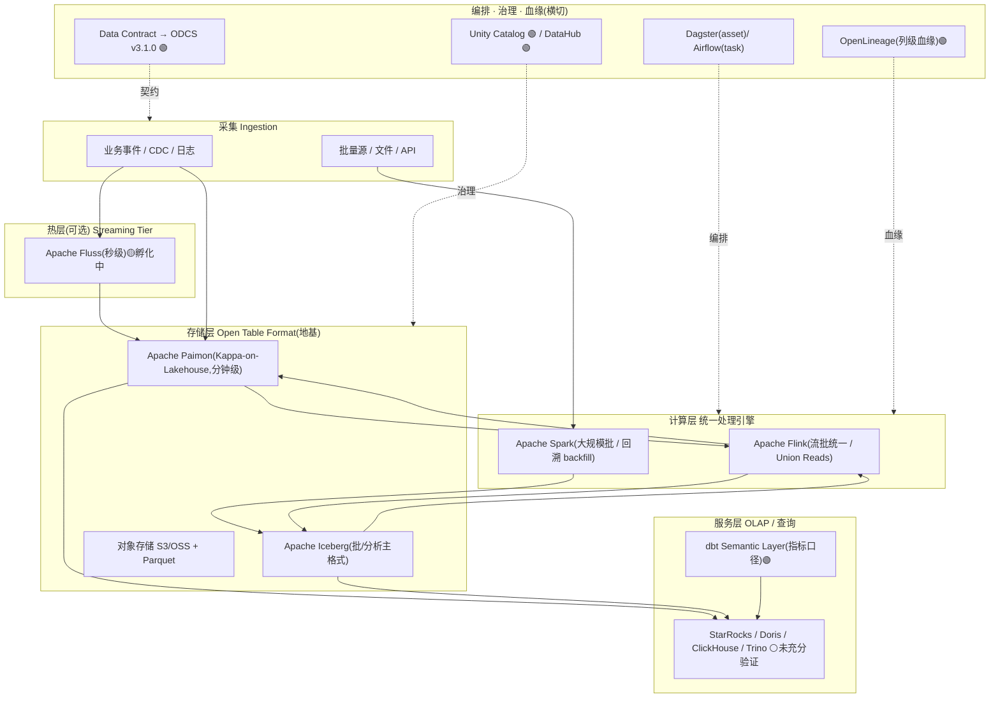

# 2026 企业级 PB 规模流批一体数仓/数据湖技术方案(总纲)

> 本系列采用「总-分-分」结构:本文(11)是**总纲**,给出决策级选型主张与整体参考架构;
> 五个分支(11a~11e)是**详细论证**。本系列区别于前 10 篇学习笔记(01~10 讲方法论与基础设施原理),
> 定位为**企业级决策参考**。
>
> ⚠️ **方法论声明(重要)**:本方案由 `deep-research` workflow 产出——扇出检索、抓取权威来源、
> 对每条关键断言做 3 票对抗式验证(2/3 反驳即淘汰),再综合。因此本文对每条结论**显式标注置信度**,
> 并单列「**被证伪断言(避坑清单)**」与「**证据不足的开放问题**」两节。
> 凡验证语料不足以支撑的角度(尤其计算引擎选型、物理分层建模),本文**如实标注为开放问题,不做过度断言**。

---

## 0. 置信度图例

| 标记 | 含义 |
|---|---|
| 🟢 **high** | 有独立第三方(官方文档 / 同行评审论文 / 独立云厂商)交叉印证的技术事实 |
| 🟡 **medium** | 多源一致,但主要来源为厂商博客或低层级期刊,属典型情形归纳 |
| 🔴 **refuted** | 经对抗验证被推翻,**不得作为方案依据**(见第 7 节) |
| ⚪ **open** | 验证语料不足,需在实施时二次验证(见第 8 节) |

---

## 1. 执行摘要(Executive Summary)

面向 **2026 年、PB 级、流批一体**的企业湖仓,经核查证据支持如下**决策主轴**:

1. **架构范式已收敛为三分类** 🟡:Separate-Pipelines(独立管线+统一存储)/ Lambda / Kappa,
   并派生出「**Streaming Lakehouse**」这一在湖仓之上直接跑 Kappa 的新分支。**流批一体不等于消灭 Lambda**——
   在「重算量大且罕见、受监管需独立留痕、仅需短鲜度窗口、源非事件形态」等场景 Lambda 仍是正解。
2. **开放表格式(Open Table Format)是地基,且流式优先栈中依然必需** 🟡:即便上了 diskless Kafka /
   流式优先架构,SQL 分析、历史快照、治理与跨引擎访问仍要求 Iceberg 类开放表格式兜底。
3. **在湖仓上落地 Kappa 的当红组合是 Apache Paimon(分钟级)+ Apache Fluss(秒级热层)** 🟢🟡:
   Fluss 的 Tiering Service 持续下沉到 Paimon/Iceberg,并通过统一 catalog + 单表抽象让 Flink 的
   **Union Reads** 合并实时与历史数据,消除传统流批栈的「双 catalog / 手工切换」难题。
   ⚠️ 但 Fluss 仍处 **Apache 孵化(early maturity)**,「已解决」带有前瞻色彩。
4. **治理/元数据层的最强验证信号**是 **Unity Catalog** 的多接口互操作(Delta Sharing + UniForm +
   Iceberg REST Catalog,2024-06 开源,治理范围含非结构化与 AI 资产)🟢、**OpenLineage** 作为可互操作的
   血缘标准 🟢、以及数据契约向 **ODCS v3.1.0** 收敛(旧 Data Contract Specification 已弃用,工具支持仅到 2026 年底)🟢。
5. **指标/语义层**用 **dbt Semantic Layer(MetricFlow,Apache 2.0)** 🟢:在查询时生成带自动 JOIN 的 SQL,
   而非物化指标表。

> **一句话选型主张**:PB 级流批一体的 2026 参考栈 = **对象存储 + 开放表格式(Iceberg/Paimon)为地基**,
> **Flink 为统一处理引擎**,**Paimon(+可选 Fluss 热层)承载 Kappa-on-Lakehouse**,
> **Unity Catalog / OpenLineage / DataHub 做治理与血缘**,**dbt Semantic Layer 统一指标口径**;
> **Lambda 不淘汰,而是按场景保留**。

---

## 2. 需求与约束(方案前提假设)

| 维度 | 假设前提 |
|---|---|
| 数据规模 | PB 级历史 + 高吞吐增量(事件流为主) |
| 时效要求 | 混合:部分链路秒级/分钟级实时,部分 T+1 批处理即可 |
| 一致性 | 关键链路需 exactly-once(实为 effectively-once)与流批口径一致 |
| 成本 | 存算分离、对象存储为主,冷热分层控成本 |
| 团队 | 具备一定平台工程能力;倾向开放标准、避免单一厂商锁定 |
| 合规 | 存在受监管数据,需独立留痕、审计、列级血缘 |

> 若你的规模远低于 PB(如本项目 tushare-dashboard 的单机 DuckDB 量级),本方案属于**上限参考**;
> 实际可退化为「对象存储 + 单一开放表格式 + dbt + 轻量编排」,不必全量堆栈。参见 [11c](11c-compute-engine.md) 对 DuckDB 嵌入式定位的讨论。

---

## 3. 整体参考架构

**端到端数据流**:采集 →(可选 Fluss 秒级热层)→ Paimon/Iceberg 开放表格式 → Flink 统一流批处理(Union Reads 合并实时+历史)→ OLAP 服务层 / dbt 语义层 → 横切的编排、治理、血缘、契约。

---

## 4. 分层选型决策(首选 / 备选 / 不推荐)

> 逐层给出建议;**置信度**沿用第 0 节图例;详细论证见对应分支。

### 4.1 架构范式(详见 [11a](11a-architecture-paradigm.md))

| | 选择 | 理由 | 置信度 |
|---|---|---|---|
| 首选 | **Kappa-on-Lakehouse**(事件驱动主链路) | 事件承载持久业务语义(订单/支付/遥测/安全信号)、日志即产品边界时;单一模型延迟更稳、资源更省 | 🟡 |
| 保留 | **Lambda**(特定场景) | 重算量大且罕见/表导向、受监管需独立留痕、仅需短鲜度窗口、批治理成熟但流运维弱、源非事件形态 | 🟢 |
| 不推荐 | 盲目「一份代码/一份存储」全量流批一体 | 现实与目标仍有差距;流批一致性、状态回溯、实时 SCD 仍是硬难题 | 🟡 |

### 4.2 存储与开放表格式(详见 [11b](11b-storage-table-format.md))

| | 选择 | 理由 | 置信度 |
|---|---|---|---|
| 首选(流) | **Apache Paimon** | 在湖仓上直接实现 Kappa,分钟级更新,直接操作对象存储文件 | 🟡 |
| 首选(批/分析) | **Apache Iceberg** | 事实标准化、REST Catalog、跨引擎;curated 流也建议 sink 到 Iceberg | 🟡 |
| 热层(可选) | **Apache Fluss** | 秒级热层 + Tiering Service 下沉 + Union Reads 消除双 catalog | 🟢(能力)/ ⚠️孵化中 |
| 待定 | Delta / Hudi 的取舍 | 头对头对比(写放大/CDC 吞吐/compaction 成本)证据不足 | ⚪ |

### 4.3 计算与查询引擎(详见 [11c](11c-compute-engine.md))

| | 选择 | 理由 | 置信度 |
|---|---|---|---|
| 首选(处理) | **Apache Flink** | 真流 + 批,Union Reads 原生合并实时/历史 | 🟡 |
| 备选(处理) | **Apache Spark** | 大规模批、回溯 backfill、生态成熟 | 🟡 |
| 服务(OLAP) | StarRocks / Doris / ClickHouse / Trino / DuckDB | **⚠️ 验证语料薄弱,未有幸存断言给出决策标准或基准** | ⚪ |

### 4.4 分层与建模(详见 [11d](11d-layered-modeling.md))

| | 选择 | 理由 | 置信度 |
|---|---|---|---|
| 首选(语义) | **dbt Semantic Layer / MetricFlow** | 集中定义指标、查询时生成带自动 JOIN 的 SQL、避免 fan-out/chasm join | 🟢 |
| 待定 | ODS/DWD/DWS/ADS 实时化的物理落地、Kimball vs Data Vault 取舍 | **验证语料未覆盖物理分层设计** | ⚪ |

### 4.5 编排 · 治理 · 血缘(详见 [11e](11e-governance-orchestration.md))

| | 选择 | 理由 | 置信度 |
|---|---|---|---|
| 治理/目录 | **Unity Catalog** | Delta Sharing + UniForm + Iceberg REST Catalog 三接口互操作;2024-06 开源;治理含非结构化 + AI 资产 | 🟢 |
| 血缘 | **OpenLineage** | 开放可互操作标准;Airflow 经 Listener 插件零改 DAG 自动采集;DataHub 可摄取 | 🟢 |
| 元数据平台 | **DataHub** | 一方 Dagster Sensor(1.7.0+),运行后发元数据、映射 asset→Dataset | 🟢 |
| 契约 | **ODCS v3.1.0** | 旧 Data Contract Specification 已弃用,工具支持仅到 2026 底,建议迁移 | 🟢 |
| 编排 | Dagster(asset-based)/ Airflow(task-based) | 视团队与流批统一编排需求选型 | 🟡 |

---

## 5. 三套典型场景选型组合

| 维度 | 场景 A:成本优先 | 场景 B:极致实时 | 场景 C:强治理合规 |
|---|---|---|---|
| 主范式 | Lambda(批为主)/ 独立管线 | Kappa-on-Lakehouse | Lambda(独立留痕)+ 受控实时 |
| 存储 | Iceberg + 对象存储冷存 | Paimon + Fluss 秒级热层 | Iceberg(快照/审计友好) |
| 处理 | Spark 批 + 轻量流 | Flink(Union Reads) | Flink/Spark + 严格 checkpoint |
| 服务 | Trino 直查(省资源)⚪ | StarRocks/Doris 高并发 ⚪ | 受控 OLAP + 行列级权限 |
| 治理 | OpenLineage + 轻量 catalog | DataHub + UC | Unity Catalog(列级血缘+审计)+ ODCS 契约 |
| 语义层 | dbt Semantic Layer | dbt Semantic Layer | dbt Semantic Layer(口径合规) |
| 关键权衡 | 牺牲鲜度换成本 | 牺牲成本/成熟度换延迟 | 牺牲灵活性换可审计性 |

> ⚠️ 服务层引擎(标 ⚪)的具体选择在本轮验证中证据不足,上表为方向性建议,落地前须按第 8 节做二次验证与 POC 基准。

---

## 6. 关键权衡与演进路线图

**核心权衡三角**:延迟 vs 成本 vs 一致性。PB 级下,Kappa 的「资源更省」是典型情形归纳——**重算/回溯需要额外吞吐余量**,大规模批存储经济性有时反而让 Lambda 胜出(🟡,见 [11a](11a-architecture-paradigm.md))。

**建议演进路线(渐进,不要一步到位)**:

1. **地基先行**:对象存储 + 开放表格式(先 Iceberg 立标准),接入 catalog(Unity Catalog / DataHub)。
2. **血缘与契约**:铺 OpenLineage 自动采集,关键接口上 ODCS 数据契约。
3. **统一处理**:引入 Flink 承接流批,批链路保留 Spark 做回溯。
4. **流式湖仓**:在验证过延迟收益后,针对事件主链路引入 Paimon 落地 Kappa;**Fluss 热层作为可选增强,按其孵化成熟度谨慎评估**。
5. **语义统一**:上 dbt Semantic Layer 收敛指标口径。
6. **场景细化**:按第 5 节三套组合分域治理。

---

## 7. 被证伪断言(避坑清单)🔴

以下断言在 3 票对抗验证中**被推翻**,常见于厂商营销,**不得作为方案依据**:

| 被证伪断言 | 投票 | 出处 | 为何不可信 |
|---|---|---|---|
| Fluss 相比 Paimon 在 Medallion 每层累积 checkpoint 延迟(1min/层→Gold 3min),Fluss 保持秒级消除跨层累积延迟 | 1-2 | Fluss 项目博客 | 项目方自述,未获独立印证 |
| Iceberg REST Catalog 能力有限、Polaris 仅支持 Iceberg 表且无治理 API | 0-3 | Databricks UC 白皮书 | 竞品贬低框架,被验证推翻 |
| 成功的混合实现共享五大特征(统一工具/集中存储/一致元数据/可复用变换/健壮保证) | 0-3 | WJAETS 低层级期刊 | 单一作者归纳,无独立支撑 |
| 流式优先引擎不适配开放表格式(因其为批设计,Flink 连接器难满足低延迟) | 0-3 | Ververica 博客 | 与 Paimon/Iceberg+Flink 实践相悖 |
| Streamhouse 作为「统一流与湖仓的新范式」 | 1-2 | Ververica 博客 | 营销造词,非业界公认范式 |
| 2026 Lambda-vs-Kappa 决策已纯粹变成存储经济学问题 | 1-2 | 厂商博客 | 过度简化,决策仍是多因素 |

---

## 8. 证据不足的开放问题 ⚪(实施前须二次验证)

本轮验证语料在以下角度**偏薄或缺失**,方案**不做过度断言**,列为待 POC/基准的开放问题:

1. **计算/查询引擎 PB 级选型**:Flink vs Spark、StarRocks/Doris/ClickHouse/Trino/DuckDB vs 云数仓,无幸存断言给出决策标准或基准。
2. **四大开放表格式头对头**:Iceberg/Delta/Hudi/Paimon 在写放大、CDC/upsert 吞吐、compaction 成本、REST Catalog 成熟度上的排名缺证据。
3. **物理分层建模**:ODS/DWD/DWS/ADS 实时化的具体落地、与 Medallion 的映射、Kimball vs Data Vault 在流批下的取舍——本轮仅覆盖语义层,未覆盖物理设计。
4. **治理栈协同**:Unity Catalog、DataHub、Apache Polaris/Gravitino、OpenLineage 工具在单一参考架构中的互操作/竞争与推荐组合。

---

## 9. 时效性与来源质量声明

- **时效高度敏感**:Fluss 处 Apache 孵化;Data Contract Spec→ODCS 工具窗口 2026 底关闭;Paimon/Fluss/Unity Catalog 快速演进,版本相关行为(Fluss 0.5-0.9、Dagster 1.7.0+、ODCS 3.1.0)须在实施时复核。
- **来源质量**:部分承重来源为厂商博客(Fluss/Ververica/AutoMQ),标 🟢 者均有独立方(阿里云官方 Flink 文档、VLDB 论文、dbt/Airflow 官方文档)交叉印证具体技术事实。
- **验证口径**:top 25 断言 → 19 confirmed / 6 refuted / 0 unverified;另有 4 个开放问题。

---

## 10. 参考文献(经验证核心来源)

> 均来自 deep-research 检索并通过验证的真实来源;厂商博客类已在正文标注置信度。

1. WJAETS-2025-0750《混合流批处理架构》— http://wjaets.com/sites/default/files/fulltext_pdf/WJAETS-2025-0750.pdf 🟡
2. AutoMQ《Lambda vs Kappa Architecture 2026 / Diskless Kafka》— https://www.automq.com/blog/lambda-vs-kappa-architecture-2026-diskless-kafka 🟡
3. Apache Fluss《Unified Streaming Lakehouse》— https://fluss.apache.org/blog/unified-streaming-lakehouse/ 🟢(能力)
4. Apache Fluss docs《Tiering Service》— https://fluss.incubator.apache.org/docs/next/streaming-lakehouse/tiering-service/
5. 阿里云 实时计算 Flink 官方文档(Fluss+Paimon 湖流一体 Union Read,独立印证)— https://help.aliyun.com
6. Ververica《From Kappa to Streamhouse》— https://www.ververica.com/blog/from-kappa-architecture-to-streamhouse-making-lakehouse-real-time 🟡
7. Databricks / VLDB 2025《Unity Catalog: Open Universal Governance》— https://www.databricks.com/sites/default/files/2025-06/unity-catalog-open-universal-governance-lakehouse-beyond.pdf 🟢
8. Unity Catalog(开源)— https://github.com/unitycatalog/unitycatalog 🟢
9. Databricks Delta UniForm 文档 — https://docs.databricks.com/delta/uniform.html 🟢
10. dbt《How the dbt Semantic Layer works》— https://www.getdbt.com/blog/how-the-dbt-semantic-layer-works 🟢
11. dbt docs《About MetricFlow》— https://docs.getdbt.com/docs/build/about-metricflow 🟢
12. dbt docs《Semantic Layer Architecture》— https://docs.getdbt.com/docs/use-dbt-semantic-layer/sl-architecture 🟢
13. MetricFlow(Apache 2.0)— https://github.com/dbt-labs/metricflow 🟢
14. Airflow OpenLineage Provider 文档 — https://airflow.apache.org/docs/apache-airflow-providers-openlineage/stable/guides/structure.html 🟢
15. OpenLineage 官网 — https://openlineage.io 🟢
16. DataHub Dagster 集成文档 — https://datahubproject.io/docs/lineage/dagster/ 🟢
17. acryl-datahub-dagster-plugin — https://pypi.org/project/acryl-datahub-dagster-plugin/ 🟢
18. Data Contract Specification(已弃用,迁移至 ODCS)— https://datacontract-specification.com/ 🟢
19. Open Data Contract Standard(ODCS)官方文档 — https://bitol-io.github.io 🟢

---

## 附:本系列导航

| 编号 | 文档 | 定位 |
|---|---|---|
| 11 | 本文 | **总纲** / 决策蓝图 |
| 11a | [架构范式](11a-architecture-paradigm.md) | Lambda/Kappa/Streaming Lakehouse |
| 11b | [存储与开放表格式](11b-storage-table-format.md) | Iceberg/Delta/Hudi/Paimon/Fluss |
| 11c | [计算与查询引擎](11c-compute-engine.md) | Flink/Spark/OLAP 引擎 |
| 11d | [分层与建模](11d-layered-modeling.md) | 实时分层/Medallion/语义层 |
| 11e | [编排治理血缘](11e-governance-orchestration.md) | Dagster/UC/OpenLineage/契约 |

> 基础原理见前 10 篇:[01-inmon](01-inmon.md) · [02-kimball](02-kimball.md) · [03-medallion](03-medallion.md) · [04-dbt](04-dbt.md) · [05-dagster](05-dagster.md) · [06-data-lake](06-data-lake.md) · [07-batch-computing](07-batch-computing.md) · [08-stream-computing](08-stream-computing.md) · [09-oltp](09-oltp.md) · [10-olap](10-olap.md)
