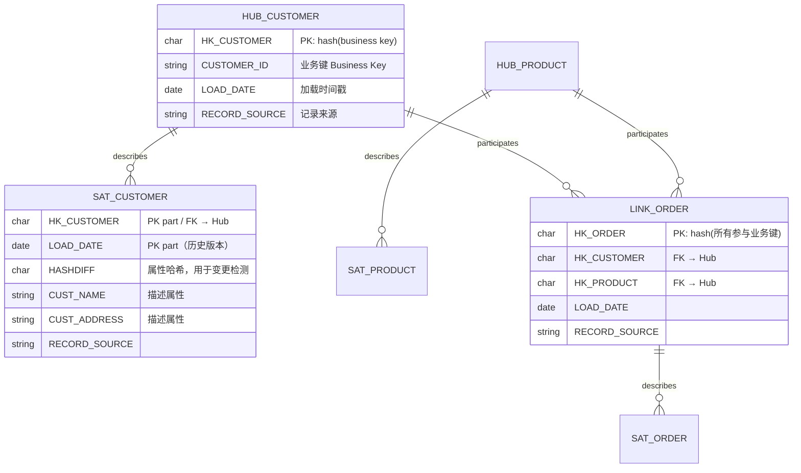

# Data Vault 2.0 建模方法论学习笔记

> 本文是数据仓库建模方法论学习笔记系列的一篇。它与前序三篇构成"企业级数仓建模三大范式 + 分层架构"的完整拼图，建议对照阅读：
>
> - [`01-inmon.md`](01-inmon.md) — Inmon 企业信息工厂（CIF）与 **3NF 范式建模**（自顶向下、企业级规范层）
> - [`02-kimball.md`](02-kimball.md) — Kimball **维度建模**与总线架构（自底向上、面向 BI 消费）
> - [`03-medallion.md`](03-medallion.md) — Medallion（Bronze/Silver/Gold）**分层架构**
> - **本篇 `12-data-vault.md` — Data Vault 2.0**：与 Inmon、Kimball 并列的**第三大数仓建模方法论**
> - [`11d-layered-modeling.md`](11d-layered-modeling.md) 曾提出"**Kimball 维度建模 vs Data Vault 2.0 vs One Big Table**"在 PB 级下如何取舍这一开放问题（标 ⚪，无幸存断言）——**本篇即是对其中 Data Vault 2.0 一支的详细展开**。
>
> 目标读者：有一定数据工程基础、希望系统理解 Data Vault 的工程师。术语首次出现保留英文原文，便于对照 Dan Linstedt 原著与官方资料。

---

## 0. 一句话定位：它到底解决了什么问题

在 Inmon（3NF 企业级规范层）与 Kimball（维度建模面向消费）之外，Data Vault 是**第三条路线**。它诞生的动机可以浓缩成一句话：

> **当企业有数十个源系统、强合规审计要求、且源系统结构频繁变化时，Inmon 的 3NF 会"改一处牵全身"，Kimball 的星型模型难以保存"发生过什么"的完整历史——Data Vault 用 Hub / Link / Satellite 三种结构，把"业务键、关系、描述属性"彻底解耦，从而同时拿到可审计、可扩展、抗变化三个特性。**

它的官方定义是一种面向**可扩展企业级数据仓库集成层**的建模方法论，聚焦于数仓的**长期可持续性、可扩展性与灵活性**[^atlan][^altexsoft]。发明人 Dan Linstedt 本人把它称为**"3NF 与星型模型之间的混血（a hybrid approach encompassing the best of breed between 3NF and star schema）"**[^dv-wiki]。

一个关键认知误区要先破除：**Data Vault 不是直接面向 BI 报表消费的模型**。它是"企业级集成层 / 系统记录层"，最终仍要通过视图或 ETL 转换成 Kimball 维度模型（在 DV 术语里叫 Information Mart）对外服务[^dv-wiki][^redgate-mart]。这一点贯穿全文，请务必记住。

---

## 1. 起源与演进：Dan Linstedt 与两个版本

### 1.1 起源（1990s–2000s）

Data Vault 由 **Dan Linstedt** 在 1990 年代构思，2000 年前后释入公有领域（public domain）[^dv-wiki][^atlan]。早期它并不叫 "Data Vault"，而叫 *common foundational warehouse architecture* / *common foundational modeling architecture*（一个很少用的全称是 *Common Foundational Integration Modelling Architecture*）[^dv-wiki]。Linstedt 通过 *The Data Administration Newsletter* 上的五篇连载系统阐述了该方法（概览、组件、结束日期与 JOIN、Link 表、加载实践）[^dv-wiki]。**Data Vault 1.0 于 2000 年正式提出、2002 年公开发表**[^dawiso]。

Linstedt 的背景是数据仓库与业务智能专家；他在提出 DV 前已构建过大量 Kimball 风格的数据集市，并持有 CBIP、DAMA 等大师级认证——这说明 DV 不是"反 Kimball"，而是他在实践中对"企业级集成层缺失"的回应[^dv-faq]。

### 1.2 Data Vault 1.0 → 2.0（约 2013）

**Data Vault 2.0 在 2013 年前后发布**，其权威文献是 Linstedt & Olschimke 合著的 **《Building a Scalable Data Warehouse with Data Vault 2.0》**（Morgan Kaufmann / Elsevier, 2015，面向 SQL Server 2014 的实现指南）[^dv-wiki][^book]。1.0 主要只讲"模型"；2.0 则从一个建模技术升级为一整套**开放标准**，建立在三根支柱之上[^dv-wiki][^wherescape-20]：

| 支柱 | Data Vault 2.0 的内容 |
|---|---|
| **方法论（Methodology）** | 融合 SEI/CMMI Level 5、Six Sigma、TQM、SDLC 与 Scott Ambler 的敏捷方法；采用短周期、范围受控的迭代，**每 2–3 周一次生产发布**[^dv-wiki] |
| **架构（Architecture）** | 明确 Staging（可选持久化暂存 PSA）→ Raw Vault → Business Vault → Information Mart 的分层，纳入数据质量与主数据服务[^dv-wiki] |
| **模型（Model）** | Hub / Link / Satellite 三大组件**保持不变**，但补齐了标准化规则[^wherescape-20] |

2.0 相对 1.0 的**核心技术变化**（也是最常被考的点）：

1. **哈希键（Hash Key）取代序列号（Sequence Number）**作为代理主键——这是"范式级"的转变，直接带来 100% 并行加载能力[^patrickcuba][^scalefree-hash]。
2. **标准化的加载模式、命名规范与哈希键生成规则**——1.0 留白的地方被明确定义[^wherescape-20]。
3. 面向 **Big Data / NoSQL / 非结构化与半结构化数据**的集成能力，聚焦性能与最佳实践[^dv-wiki]。

> 记忆锚点：**"1.0 是模型，2.0 是方法论 + 架构 + 模型，且用 hash 键换掉了 sequence 键。"**

---

## 2. 三大核心建模组件

Data Vault 的全部魔力都来自一个动作：**把传统一张表里的三类信息拆开存**——

- **业务键（Business Key）** → 存进 **Hub**
- **业务键之间的关系（Relationship）** → 存进 **Link**
- **描述性属性及其历史变化（Descriptive Attributes / History）** → 存进 **Satellite**

因为三者物理上不直接互相 JOIN、互不依赖，所以它们可以**完全并行加载**，且新增源系统 / 新增属性只需"加表"而非"改表"[^dawiso][^apxml-impl]。下面逐一拆解。



### 2.1 Hub（中心表）——只存业务键

Hub 是整个模型的**集成锚点（integration point）**。它只存储一个核心业务概念的**唯一业务键**，加上极少量的血缘 / 审计元数据[^dv-wiki][^shaabani]。

一个 Hub 的标准列（DV2.0）：

| 列 | 含义 | 说明 |
|---|---|---|
| **Hash Key**（如 `HK_CUSTOMER`） | 主键 | 对业务键做哈希得到的定长键（DV2.0）；DV1.0 时代是 sequence 代理键 |
| **Business Key**（如 `CUSTOMER_ID`） | 业务键 | 业务侧真正用来识别对象的自然键，可为复合键（多列） |
| **Load Date / Load DTS** | 加载时间戳 | 该业务键**首次**进入仓库的时间 |
| **Record Source** | 记录来源 | 该键首次由哪个源系统加载，用于审计溯源 |

关键设计原则：

- **业务键要选"低变更倾向（low propensity to change）"的键**——客户号、SKU、航班号这类企业级稳定标识，而不是易变的描述属性[^dv-wiki]。
- **同一业务概念在整个企业只有一个 Hub**。不同源系统的同一个"客户"，只要业务键语义相同，就哈希到同一个 Hub——这正是 DV 实现**跨源集成**的机制[^scalefree-hash]。
- Hub 本身**不含任何描述属性**（没有姓名、地址），描述属性一律放到 Satellite。
- 一个 Hub 通常至少挂一个 Satellite（否则只有键没有内容）[^dv-wiki]。

### 2.2 Link（链接表）——只存关系

Link 捕获 Hub 之间的**关系**，天然表达**多对多（many-to-many）**与**事务（transaction）**。参与关系的各 Hub 的键共同定义了 Link 的粒度（grain）[^dv-wiki][^shaabani]。

一个 Link 的标准列：

| 列 | 含义 |
|---|---|
| **Hash Key**（如 `HK_ORDER`） | Link 自身主键 = 对**所有参与业务键的组合**做哈希 |
| **各 Hub 的 Hash Key** | 指向每个参与 Hub 的外键（如 `HK_CUSTOMER`、`HK_PRODUCT`） |
| **Load Date** | 该关系首次出现的时间 |
| **Record Source** | 记录来源 |

关键设计原则：

- Link 里**只放键，不放描述属性**。关系的描述属性（如订单金额、下单渠道）放到挂在 Link 上的 Satellite。
- Link **天然是多对多**。即使当前业务规则是一对多，用 Link 也能无痛适应未来变成多对多——这是 DV"抗变化"的重要来源。
- **Link 可以引用 Link，但强烈不推荐**：这会重新引入加载依赖，破坏并行加载[^dv-wiki]。
- 有一种特殊 Satellite 叫 **Effectivity Satellite（生效卫星表）**，挂在 Link 上记录一段关系"从何时生效、到何时失效"，用于表达关系的时间有效性[^dv-wiki]。

### 2.3 Satellite（卫星表）——存描述属性与历史

Satellite 存放某个 Hub 或 Link 的**描述性属性及其全部历史**。它是**append-only（只追加）**的：每次属性发生变化就插入一行新记录，旧记录永不删除、永不覆盖——因此它**天然保存了完整历史，语义上类似 Kimball 的 SCD Type 2**[^dv-wiki][^tdwi]。

一个 Satellite 的标准列：

| 列 | 含义 |
|---|---|
| **Parent Hash Key** | 指向父 Hub 或父 Link（如 `HK_CUSTOMER`） |
| **Load Date / Load DTS** | 该版本记录的加载时间；与父键共同构成主键，实现多版本历史 |
| **Load End Date**（可选） | 该版本的失效时间（有些实现用它标记版本区间） |
| **HashDiff**（DV2.0） | 对本行所有描述属性做哈希，用于**快速变更检测**（见 §3.2） |
| **描述属性们** | 姓名、地址、金额、风险类别……至少一个 |
| **Record Source** | 记录来源 |

Satellite 的**拆分原则**（一个 Hub/Link 可挂多个 Satellite）：

- **按源系统拆**：CRM 来的客户属性一张 Sat，ERP 来的客户属性另一张 Sat——保持审计边界清晰。
- **按变化率（rate of change）拆**：高频变化的属性（如信用评分）单独一张 Sat，慢变属性（如出生日期）另一张——避免高频变化把慢变数据也一起复制，节省存储、加速加载[^dv-wiki][^tdwi]。

> 三件套记忆法：**Hub = 名词（谁/什么）、Link = 动词（发生了什么关系）、Satellite = 形容词（长什么样、何时变的）。**

---

## 3. 辅助组件与哈希键

### 3.1 辅助结构：Reference / PIT / Bridge

除了三大核心组件，DV 还有几类辅助结构：

- **Reference Table（参考表）**：存放高频引用的简单编码-描述映射（如国家码→国家名、风险类别码→描述），避免在每张 Satellite 里冗余存全称。Linstedt 定义参考数据为"任何用于将编码解析为描述、或统一翻译键的信息"。参考表被 Satellite 引用，但**从不建物理外键约束**，也无固定结构[^dv-wiki]。
- **Point-in-Time（PIT）表**：属于 Business Vault 的**查询辅助表**。当一个 Hub 挂了多个 Satellite（各自变更节奏不同）时，要还原"某个时间点的完整快照"需要在多张 Sat 上做复杂的时间区间 JOIN。PIT 表预先把"某时间点各 Sat 对应哪一版记录"物化下来，**大幅减少 JOIN 与时间过滤的开销**[^automate-bridge][^redgate-bv]。
- **Bridge 表**：同样是 Business Vault 的查询辅助表，作用类似 PIT，但**跨多个 Hub 与 Link** 预 JOIN，减少访问 Raw Vault 时需要串联的表数量，加速下游查询[^automate-bridge]。

> PIT 与 Bridge 都是**性能优化的"缓存表"**，不承载新语义、可随时重建——这与 Hub/Link/Sat 这类"系统记录"结构有本质区别。

### 3.2 哈希键（Hash Key）：DV2.0 的招牌，也是争议点

哈希键是 DV1.0→2.0 最重要的技术跃迁，值得单独深入。

**为什么用哈希键取代序列号？** DV1.0 用序列号（sequence）当代理键，导致**加载依赖链**：Link/Satellite 要先查父 Hub 的 sequence 才能拿到外键，于是 **Hub 必须先加载、Link/Sat 才能加载**，实时场景尤其吃亏[^scalefree-hash]。哈希键把主键定义为**"对业务键直接做哈希"**——不需要查父表，`hash(业务键)` 在任何地方算出来都一样，于是[^scalefree-hash][^patrickcuba]：

1. **100% 并行加载**：Hub、Link、Satellite 互不依赖，可同时灌数。这是 DV2.0 号称的核心优势[^apxml-impl][^wherescape-relevant]。
2. **跨平台 JOIN**：不做哈希时，往 Hadoop/NoSQL 灌数还得回关系库查 sequence；哈希后可在异构平台（如 Teradata ↔ Hadoop）间直接按哈希键 JOIN[^scalefree-hash]。
3. **定长键，JOIN 性能稳定**：复合业务键可能是变长、多类型的，很多引擎在变长键上 JOIN 效率差；哈希成定长单列后性能一致[^scalefree-hash]。

**Hash Key vs HashDiff——别混淆：**

- **Hash Key** = 对**业务键**哈希，用作 Hub/Link 主键、Sat 外键。
- **HashDiff** = 对某行**所有描述属性**哈希，用于 Satellite 的**变更检测**：加载时先看 Hash Key 是否已存在、再比 HashDiff 是否变化，变了才插新版本，避免逐列比对[^scalefree-hash]。

**用哪种哈希算法？** 常见候选 MD5、MD6、SHA-1、SHA-2。Scalefree 在多数场景推荐 **MD5（128 位）**——它跨平台最普及、碰撞概率低、存储成本可接受；且哈希总能从业务键重算，"永不丢失"[^scalefree-hash]。

**哈希碰撞（collision）的争议：** 碰撞指两个不同输入产生相同哈希。Scalefree 认为在超过一万亿条哈希的库中发生碰撞的概率，堪比"陨石砸中你的数据中心"，风险极小；缓解手段是**在 staging 阶段计算哈希**，那里有时间做碰撞检查再入库[^scalefree-hash]。尽管如此，MD5 在密码学上已被证明可构造碰撞，对极端合规场景有人主张改用 SHA-256——这属于工程权衡，Snowflake/BigQuery 等 MPP 平台上也有人质疑"用哈希 PK 会比直接用业务键 JOIN 略慢"[^krupenin]。

**跨源同名不同物问题：** 当不同源系统里同一个业务键其实指代不同对象时，需在哈希前给业务键拼上一个**业务键碰撞码（Business Key Collision Code, BKCC）**（用分隔符连接）；反之若同键即同物，则不加 BKCC，让 Hub 自动完成跨源集成[^scalefree-hash]。

> 一句话总结：**哈希键 = 用"可计算的确定性主键"换掉"需要查表的序列键"，代价是存储和可读性，收益是并行加载与跨平台一致性。它"highly recommended 但非 mandatory"[^scalefree-hash]。**

---

## 4. Data Vault 2.0 分层架构

Data Vault 不只是三张表，它规定了一套完整的**分层数据流**，把"如实保存"与"业务加工"严格隔离[^dv-wiki][^azure-synapse][^redgate-bv]：

```
源系统                                                        对外消费
  │                                                              ▲
  ▼                                                              │
┌─────────┐   ┌──────────────┐   ┌──────────────┐   ┌────────────────────┐
│ Staging │──▶│  Raw Vault   │──▶│Business Vault│──▶│  Information Mart   │
│（暂存/  │   │（原始金库：  │   │（业务金库：  │   │（信息集市：常用    │
│ PSA）   │   │ Hub/Link/Sat │   │ 应用业务规则 │   │ Kimball 维度模型   │
│         │   │ 如实照搬，   │   │ + PIT/Bridge │   │ 对外服务 BI）      │
│         │   │ 不做清洗）   │   │ 等衍生结构） │   │                    │
└─────────┘   └──────────────┘   └──────────────┘   └────────────────────┘
              ← 系统记录层（System of Record）→     ← 信息交付层 →
```

| 层 | 职责 | 关键特征 |
|---|---|---|
| **Staging / PSA** | 落地源数据，做类型转换、计算哈希键/HashDiff，**不做业务清洗** | 可选做持久化暂存区（Persistent Staging Area） |
| **Raw Vault（原始金库）** | 用 Hub/Link/Sat **如实保存**源数据的粒度历史，**只加不删、不清洗** | 系统记录层；保存"单一版本的事实"而非"单一版本的真相" |
| **Business Vault（业务金库）** | 在 Raw Vault 之上应用**选定的业务规则**、反规范化、计算，并放置 PIT/Bridge 等查询辅助结构 | 是 Raw Vault 的扩展，同样可审计、可重建[^redgate-bv] |
| **Information Mart（信息集市）** | 面向消费的最终交付层，**通常就是 Kimball 星型模型**（DV2.0 把 "Data Mart" 更名为 "Information Mart" 以示精确） | 常以视图形式实现，清洗/口径在此发生[^redgate-mart] |

**最关键的哲学——"单一版本的事实"而非"单一版本的真相"**：Data Vault 在 Raw Vault 里**不区分好数据与坏数据**（"bad" 指不符合业务规则），它存"all the data, all of the time"，即**照单全收**。清洗（cleansing）只发生在下游 Information Mart，而非历史存储区[^dv-wiki]。这正是它满足 **Sarbanes-Oxley 等强审计合规**的根基：审计员总能追溯到"源系统当时到底传了什么"。

> 注意 DV 分层与 Medallion（[03-medallion](03-medallion.md)）的映射：**Staging≈Bronze、Raw+Business Vault≈Silver、Information Mart≈Gold**。二者并不冲突，业界常把 Data Vault 作为 Medallion Silver 层的**建模方法**落地[^magicedtech]。

---

## 5. 三大范式对比：Data Vault vs Kimball vs Inmon

这是本篇最需要客观呈现的部分。三者**不是"谁淘汰谁"，而是解决不同层次的问题**——事实上一个成熟企业常常三者并存：Inmon/DV 做企业级集成层，Kimball 做对外消费层。

| 维度 | **Inmon（3NF/CIF）** | **Kimball（维度建模）** | **Data Vault 2.0** |
|---|---|---|---|
| 定位 | 企业级规范化数仓（自顶向下） | 面向 BI 消费的集市（自底向上） | 企业级**集成层 / 系统记录层** |
| 建模范式 | 3NF 范式 | 星型 / 雪花 | Hub / Link / Satellite（3NF 与星型的"混血"）[^dv-wiki] |
| 首要目标 | 数据一致性、无冗余 | 可理解性 + 查询性能 | **可审计 + 可扩展 + 抗变化** |
| 对源变化的适应 | 差：改结构牵一发动全身 | 中：SCD 处理历史，但重构维度成本高 | **强：新增源/属性只加表不改表**[^dawiso] |
| 历史/审计 | 一般 | SCD Type 2 保留维度历史 | **原生全量审计，只加不删**[^dv-wiki] |
| 加载并行度 | 有依赖 | 有依赖（先维度后事实） | **100% 并行（哈希键）**[^apxml-impl] |
| 表数量 | 中 | 少（星型简洁） | **多（爆炸式增长）** |
| 查询复杂度 | 高（大量 JOIN） | **低（星型极友好）** | **高（大量 JOIN，不适合直接 BI）**[^dv-wiki] |
| 直接面向 BI | 否（需下游集市） | **是** | **否（需转成 Information Mart）**[^dv-wiki] |
| 学习曲线 | 中 | 低 | **高（需资深架构师）**[^dv-wiki] |
| 合规审计场景 | 中 | 弱 | **最强（SOX、金融、医疗）** |

**如何理解三者关系**（学术界有专门的对比研究[^arxiv-compare]）：

- **Kimball 是"直接可用"**：简单、快、BI 工具即插即用，但企业级集成与审计弱。
- **Inmon 是"稳定规范"**：一致性最高，但对源系统变化脆弱、交付慢。
- **Data Vault 是"以变化为设计前提"**：它假设"源系统一定会变、一定会加"，用解耦换来抗变化与审计，代价是表爆炸与查询复杂——所以它**不直接对外**，而是充当中间的集成/历史层，下游再用 Kimball 交付。

从 Data Vault 转成维度模型很自然（Hub+Sat→维度，Link+Sat→事实，可用视图实现）；但**反向从维度模型倒推回 Data Vault 很困难**，因为事实表已高度反规范化[^dv-wiki]。这也解释了为何 DV 定位在"更上游"。

---

## 6. 优点与缺点

**优点（Why Data Vault）**[^dv-wiki][^apxml-impl][^wherescape-guide]：

- ✅ **完整可审计 / 可溯源**：只加不删 + Record Source + Load Date，满足 SOX 等合规。
- ✅ **抗变化 / 高可扩展**：结构信息（Hub/Link）与描述属性（Sat）解耦，新增源系统或属性靠"加表"，不改既有结构、不破坏历史。
- ✅ **100% 并行加载**：哈希键消除加载依赖，大规模实现可横向扩展，无需重构。
- ✅ **ETL 高度模式化、易自动化**：三种结构 + 标准加载模板，天然适合代码生成工具（AutomateDV、VaultSpeed、WhereScape 等）。

**缺点（Why Not / 代价）**[^dv-wiki][^altexsoft]：

- ❌ **表数量爆炸**：一个业务实体拆成 Hub + 多个 Sat，加关系的 Link，表数量远超星型模型，运维对象激增。
- ❌ **JOIN 复杂、查询性能差**：还原一个"完整视图"要串联大量 Hub/Link/Sat，模型层**不为查询性能优化**，普通 BI 工具难以直接查询，必须转成维度模型[^dv-wiki]。
- ❌ **学习曲线陡**：被官方称为"高级技术"，需要**资深数据架构师**，团队上手成本高[^dv-wiki]。
- ❌ **哈希键的额外存储与不可读性**，以及 MD5 碰撞在极端合规场景的理论隐患（§3.2）。

> 工程判断：**如果你的数仓只有 1–2 个源、审计要求不高、团队小、要尽快出报表——直接上 Kimball，别碰 Data Vault。DV 的复杂度只有在"多源 + 强审计 + 频繁变化 + 长期演进"的规模下才回本。**

---

## 7. 适用场景

Data Vault 明显更适合以下场景[^wherescape-guide][^atlan]：

- **强合规审计**：金融、保险、医疗、政府——需要证明"任意历史时点，源系统给了什么值"。
- **多源集成**：数十个源系统、且同一业务概念散落多处，需要在企业级统一集成（靠 Hub 的业务键集成能力）。
- **源系统频繁变化 / 长期演进**：并购整合、SaaS 源频繁改 schema、需求高频迭代——用"加表不改表"吸收变化。
- **需要长期可持续、可横向扩展的企业级数仓底座**，而非一次性报表项目。

**不适合**：小规模、单一源、快速出 BI 报表、团队缺乏资深架构师的场景——此时 Kimball 的性价比远高。

---

## 8. 面向现代 Lakehouse / 流批一体时代的适应

Data Vault 诞生于关系型 MPP 时代，但它的设计恰好与云 Lakehouse 高度契合——这也是它在 2025–2026 仍被讨论的原因[^wherescape-relevant]：

- **哈希键天生适配 MPP / 云仓**：Snowflake、BigQuery、Databricks 等云平台**避免用自增序列**（需要中心协调、成为瓶颈），哈希键的"可计算、无依赖"特性正好契合，支持大规模并行加载[^apxml-practice]。
- **与 Medallion 架构融合**：业界已有成熟实践把 Data Vault 作为 Lakehouse **Silver 层的建模方法**（Bronze 落地 → Silver 用 Raw/Business Vault 建模 → Gold 出 Information Mart），在 Azure Databricks / Synapse 上均有官方蓝图[^azure-databricks][^azure-synapse][^magicedtech]。
- **与 dbt 等 Analytics Engineering 工具结合**：`AutomateDV`（原 dbtvault）、`datavault4dbt` 等 dbt 包用宏自动生成 Hub/Link/Sat 的加载 SQL，把 DV 的"模式化 ETL"优势发挥到极致（呼应 [04-dbt](04-dbt.md)）。

**但要清醒**：正如 [11d-layered-modeling](11d-layered-modeling.md) 所标注的，"Kimball vs Data Vault 2.0 vs One Big Table 在 PB 级如何选"**目前缺乏经严格核查的幸存断言（⚪）**。流批一体下的实时 Data Vault（real-time DV、streaming satellites）、宽表（OBT）在列存 Lakehouse 上对 DV 的挤压，都仍是需要在自身场景 POC 的开放问题。本篇给出 DV 的**原理与取舍框架**，而非"某某规模必用 DV"的最佳实践断言。

---

## 9. 小结与速查

- **定位**：与 Inmon、Kimball 并列的**第三大数仓建模方法论**；是**企业级集成/系统记录层**，非直接 BI 消费层。
- **一句话哲学**：存"**单一版本的事实（single version of the facts）**"——照单全收、只加不删，清洗留到下游。
- **三大组件**：**Hub**（业务键）+ **Link**（关系，天然多对多）+ **Satellite**（描述属性 + 历史，append-only ≈ SCD2）。
- **辅助**：Reference（编码表）、PIT / Bridge（Business Vault 查询辅助/性能表）。
- **DV2.0 招牌**：**Hash Key** 取代 sequence → 100% 并行加载、跨平台 JOIN；**HashDiff** 做变更检测；MD5 常用，碰撞风险极小。
- **四层架构**：Staging → **Raw Vault**（如实保存）→ **Business Vault**（业务规则）→ **Information Mart**（Kimball 维度模型对外）。
- **核心权衡**：审计性 / 可扩展性 / 并行加载 / 抗变化 **↔** 表数量爆炸 / JOIN 复杂 / 查询性能差 / 学习曲线陡。
- **选型口诀**：**多源 + 强审计 + 频繁变化 + 长期演进 → Data Vault；小规模快出报表 → Kimball。二者常组合：DV 做集成层，Kimball 做交付层。**

---

## 参考文献

以下链接均来自本文撰写时（2026-07）的联网检索，为真实可访问来源。方法论权威依据为 Dan Linstedt 原著与 **《Building a Scalable Data Warehouse with Data Vault 2.0》**（Linstedt & Olschimke, Morgan Kaufmann/Elsevier, 2015）及 Data Vault Alliance / Scalefree 官方资料。

[^dv-wiki]: Wikipedia — Data vault modeling（起源、Hub/Link/Satellite 定义与列、Reference 表、加载实践、与 3NF/星型对比、优缺点、"single version of the facts"、方法论）. <https://en.wikipedia.org/wiki/Data_vault_modeling>
[^book]: Linstedt & Olschimke — *Building a Scalable Data Warehouse with Data Vault 2.0*（DV2.0 权威实现指南，ISBN 9780128025109）. <https://www.vitalsource.com/en-uk/products/building-a-scalable-data-warehouse-with-data-vault-linstedt-dan-olschimke-v9780128025109>
[^atlan]: Atlan — Data Vault Architecture: What Is It & Why Do You Need It?（Linstedt 1990s、长期可持续/可扩展/灵活）. <https://atlan.com/data-vault-architecture/>
[^altexsoft]: AltexSoft — Data Vault Warehouse Explained, Vault vs Star Schema（DV 定义、优缺点、vs 星型）. <https://www.altexsoft.com/blog/data-vault-architecture/>
[^dawiso]: Dawiso — Data Vault: Complete Guide to Scalable Data Warehouse Modeling（DV1.0 2000 提出/2002 发表、三表 insert-only、抗变化）. <https://dawiso.com/glossary/data-vault>
[^dv-faq]: Data Vault Alliance — FAQ About Data Vault 2.0（Linstedt 背景、CBIP/DAMA 认证、与 Kimball 关系）. <https://datavaultalliance.com/news/dv/faq-about-data-vault-2-0/>
[^dv-understand]: Data Vault Alliance — Data Vault 2.0 vs Star Schema vs 3NF: An Introduction. <https://datavaultalliance.com/architecture-data/understanding-data-vault-2-0/>
[^scalefree-hash]: Scalefree — Hash Keys in the Data Vault（哈希键取代序列号、并行加载、跨平台 JOIN、HashDiff、MD5 推荐、碰撞概率、BKCC）. <https://www.scalefree.com/blog/architecture/hash-keys-in-the-data-vault/>
[^patrickcuba]: Patrick Cuba (Medium) — Advantage Data Vault 2.0（DV1.0→2.0 最大差异是 hash 取代 sequence，范式转变）. <https://patrickcuba.medium.com/advantage-data-vault-2-0-c1513f933bd8>
[^wherescape-20]: WhereScape — What Is Data Vault 2.0 and How Does It Improve on Data Vault?（2.0 标准化哈希键生成与加载规则，模型不变）. <https://wherescape.com/blog/data-vault-2-0>
[^wherescape-relevant]: WhereScape — Is Data Vault 2.0 Still Relevant?（哈希键使各记录类型可独立插入、完全并行）. <https://www.wherescape.com/blog/is-data-vault-2-0-still-relevant/>
[^wherescape-guide]: WhereScape — What Is a Data Vault? A Complete Guide for Data Leaders（应对快速变化源系统、复杂关系、强审计）. <https://www.wherescape.com/blog/what-is-a-data-vault-guide/>
[^apxml-impl]: apxml — Data Vault 2.0 Implementation Guide（解耦业务键/关系/属性、100% 并行加载、消除加载依赖）. <https://apxml.com/courses/building-scalable-data-warehouses/chapter-2-advanced-data-modeling-scale/data-vault-implementation>
[^apxml-practice]: apxml — Practice: Designing a Data Vault（MPP 环境避免序列/自增键，因需中心协调成瓶颈）. <https://apxml.com/courses/building-scalable-data-warehouses/chapter-2-advanced-data-modeling-scale/practice-designing-data-vault>
[^shaabani]: Nuhad Shaabani (Medium) — Practical Introduction to Data Vault Modeling（hub 分离业务键、link 存关联、satellite 存历史属性）. <https://medium.com/@nuhad.shaabani/practical-introduction-to-data-vault-modeling-1c7fdf5b9014>
[^tdwi]: TDWI — Data Vault Modeling: An Alternative to Dimensional Modeling（satellite 与 hub 分离、按时间点存历史、易加属性）. <https://tdwi.org/blogs/data-101/2026/05/data-vault-modeling.aspx>
[^redgate-bv]: Redgate — The Business Data Vault（Business Vault 定义：Raw Vault 的扩展，应用业务规则/反规范化/查询辅助）. <https://www.red-gate.com/blog/data-vault-series-the-business-data-vault>
[^redgate-mart]: Redgate — Building an Information Mart With Your Data Vault（DV2.0 将 "Data Mart" 更名为 "Information Mart"）. <https://www.red-gate.com/de/blog/data-vault-series-building-an-information-mart-with-your-data-vault/>
[^automate-bridge]: AutomateDV Docs — Bridge Tables（PIT/Bridge 属 Business Vault 查询辅助表，减少 JOIN 与访问表数以提升性能）. <https://automate-dv.readthedocs.io/en/v0.9.0/tutorial/tut_bridges/>
[^azure-synapse]: Microsoft Tech Community — Delivering Information with Azure Synapse and Data Vault 2.0（Raw Vault/Business Vault/Information Mart 分层）. <https://techcommunity.microsoft.com/t5/analytics-on-azure-blog/delivering-information-with-azure-synapse-and-data-vault-2-0/ba-p/4390578>
[^azure-databricks]: Microsoft Tech Community — Data Vault 2.0 using Databricks Lakehouse Architecture on Azure（data lake 作 landing/staging，Raw/Business Vault + information marts）. <https://techcommunity.microsoft.com/t5/analytics-on-azure-blog/data-vault-2-0-using-databricks-lakehouse-architecture-on-azure/ba-p/3797493>
[^magicedtech]: MagicEdTech — How to Build an Auditable University Data Warehouse with Medallion + Data Vault 2.0（Medallion 与 DV2.0 结合）. <https://www.magicedtech.com/blogs/how-to-build-an-auditable-university-data-warehouse-with-medallion-architecture/>
[^krupenin]: Maksim Krupenin (Medium) — Data Vault 2.0 on Snowflake: generating and storing primary keys（哈希 PK 在 Snowflake 上查询略慢于业务键）. <https://maksimkrupenin.medium.com/data-vault-2-0-on-snowflake-approach-to-generating-and-storing-primary-keys-89e815032193>
[^arxiv-compare]: arXiv — A Comparative Analysis of Inmon, Kimball, and Data Vault（企业数仓建模三范式对比研究）. <https://arxiv.org/abs/2606.29355>
